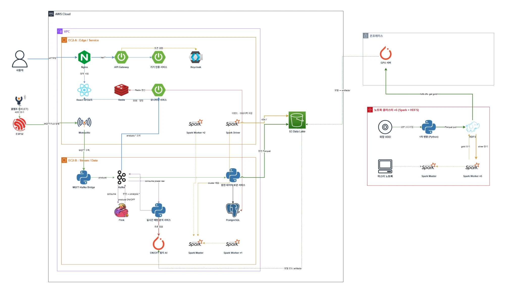
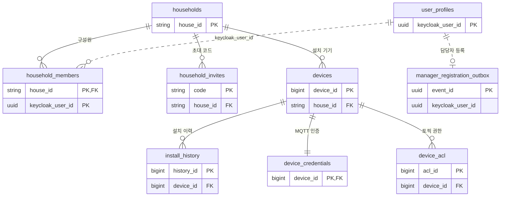
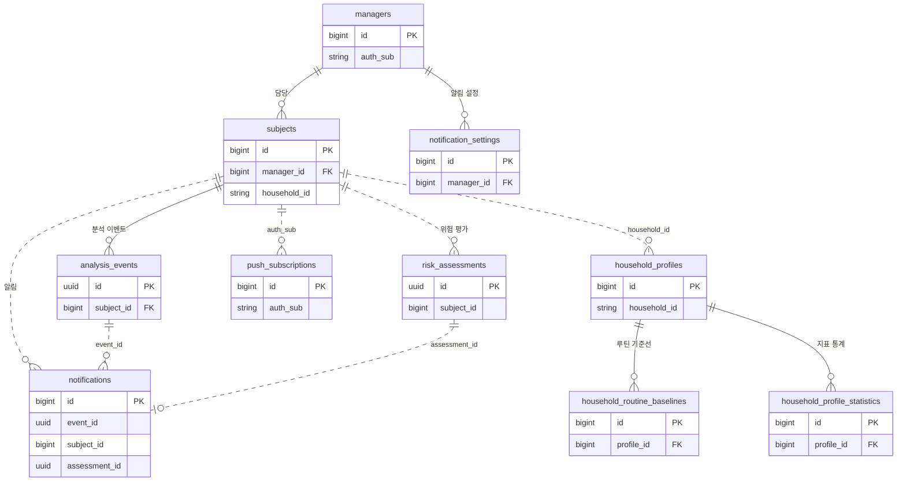
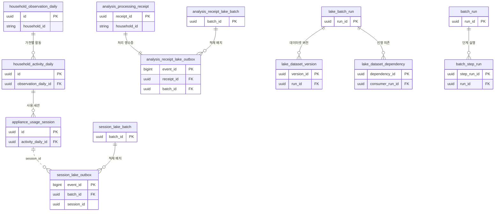
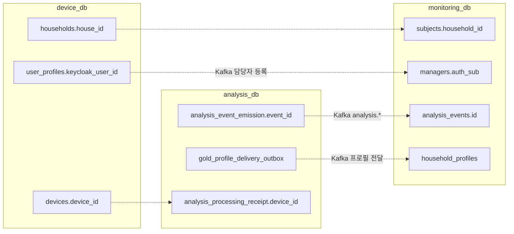

# On:마음 | 안심 알림

가전 전력 사용 패턴으로 홀로 사는 어르신의 이상 징후를 감지하고, 담당자와 대상자에게 실시간으로 알리는 서비스입니다.
클램프 센서(CT)로 측정한 전력 파형만으로 가전별 ON/OFF를 판별하고(NILM), 평소 생활 패턴과 오늘의 사용을 비교해 위험을 판단합니다.

> 로컬 실행·배포 방법과 Git 컨벤션은 [깃플로우및실행안내.md](깃플로우및실행안내.md)에 있습니다.

 

## 주요 기능

### 1. 평소 생활 패턴과 오늘 전력 사용 비교
평소 기록된 전자레인지 사용 파형을 재생하고, 같은 시간대 오늘 측정값을 실시간 MQTT로 발행해 두 패턴을 나란히 비교합니다.

### 2. 위험 감지 시 담당자 대시보드 실시간 알림
분석 서비스가 평소와 다른 사용을 감지하면 담당자 대시보드에 위험 배너와 새 알림이 즉시 뜨고, 대상자의 위험 단계와 점수가 갱신됩니다.

### 3. 대상자에게 안전 확인 요청
위험이 감지되면 대상자 화면과 브라우저 푸시로 "지금 상태를 알려주세요" 안전 확인 요청을 보내고, 대상자는 '도움이 필요해요' 또는 '괜찮아요'로 응답합니다.

### 4. 도움 요청 즉시 담당자에게 전달
대상자가 '도움이 필요해요'를 누르면 담당자 대시보드에 도움 요청 알림과 배지가 바로 표시되어 담당자가 대상자 확인·해결 처리를 할 수 있습니다.

 

## 시스템 아키텍처

 

## ERD

서비스마다 DB가 분리되어 있어 서비스 간에는 FK가 없습니다. 실선은 FK, 점선은 id로만 잇는 논리적 참조입니다.
가구는 `house_id`(= 다른 서비스의 `household_id`), 사용자는 Keycloak `sub`(`keycloak_user_id` / `auth_sub`)로 서비스 사이를 연결합니다.

### 기기 인증 서비스 (iot-device-service · `device_db`)
가구·구성원·초대와 기기, 기기별 MQTT 인증 정보를 관리합니다.

### 모니터링 서비스 (monitoring-service · `monitoring_db`)
담당자·대상자, 분석 이벤트와 알림, 위험 평가, 배치로 받은 가구 프로필을 관리합니다.

> 이 외에 `household_id` 기준 집계 테이블(`appliance_states`, `appliance_usage_episodes`, `hourly_power_usage`, `hourly_appliance_power_usage`, `household_daily_appliance_usage`, `household_observations`, `household_device_connectivity`)과 Gold 배치가 쓰는 `reporting` 스키마(`report_runs` 1:N `report_rows`)가 있습니다.

### 실시간 패턴 분석 서비스 (realtime-analysis-service · `analysis_db`)
가전 ON/OFF 세션과 일별 관측, 이벤트 발행 기록, 데이터 레이크 적재·배치 실행 이력을 관리합니다.

> 독립 테이블: `routine_baseline`, `analysis_policy`, `model_artifact`, `analysis_event_emission`, `household_outing_state`, `analysis_daily_completion`, `gold_profile_delivery_outbox`, `selected_scene_*`

### 서비스 간 연결

