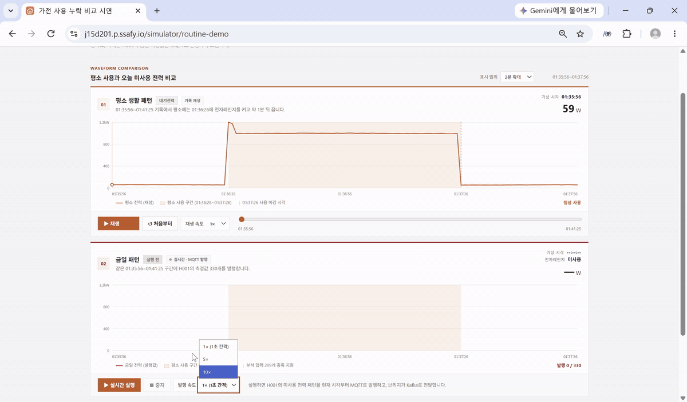
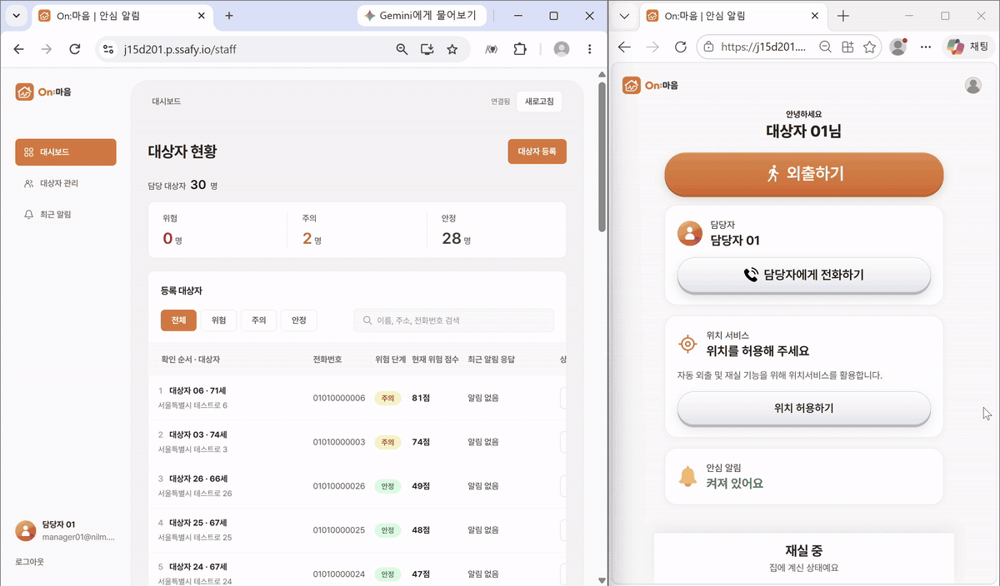
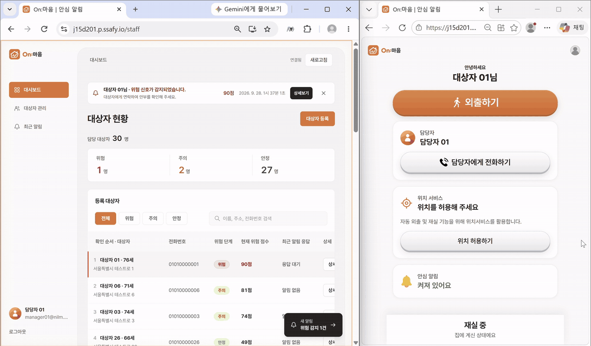
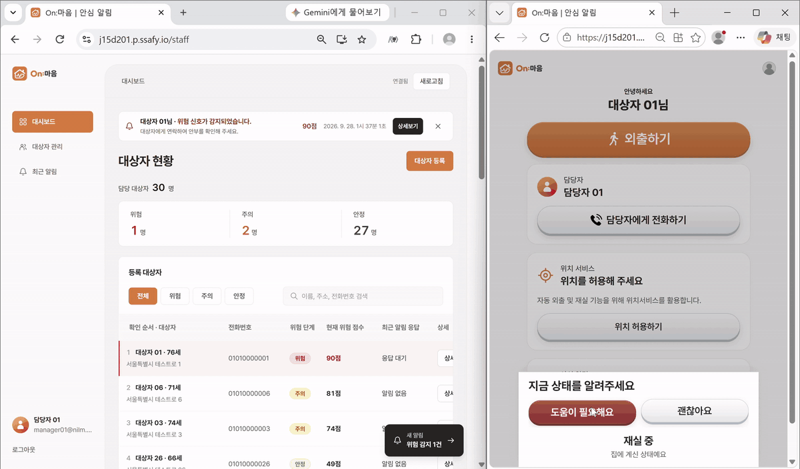

# On:마음 | 안심 알림

가전 전력 사용 패턴으로 홀로 사는 어르신의 이상 징후를 감지하고, 담당자와 대상자에게 실시간으로 알리는 서비스입니다.
클램프 센서(CT)로 측정한 전력 파형만으로 가전별 ON/OFF를 판별하고(NILM), 평소 생활 패턴과 오늘의 사용을 비교해 위험을 판단합니다.

> 로컬 실행·배포 방법과 Git 컨벤션은 [깃플로우및실행안내.md](깃플로우및실행안내.md)에 있습니다.

 

## 주요 기능

### 1. 평소 생활 패턴과 오늘 전력 사용 비교
평소 기록된 전자레인지 사용 파형을 재생하고, 같은 시간대 오늘 측정값을 실시간 MQTT로 발행해 두 패턴을 나란히 비교합니다.

### 2. 위험 감지 시 담당자 대시보드 실시간 알림
분석 서비스가 평소와 다른 사용을 감지하면 담당자 대시보드에 위험 배너와 새 알림이 즉시 뜨고, 대상자의 위험 단계와 점수가 갱신됩니다.

### 3. 대상자에게 안전 확인 요청
위험이 감지되면 대상자 화면과 브라우저 푸시로 "지금 상태를 알려주세요" 안전 확인 요청을 보내고, 대상자는 '도움이 필요해요' 또는 '괜찮아요'로 응답합니다.

### 4. 도움 요청 즉시 담당자에게 전달
대상자가 '도움이 필요해요'를 누르면 담당자 대시보드에 도움 요청 알림과 배지가 바로 표시되어 담당자가 대상자 확인·해결 처리를 할 수 있습니다.

 
