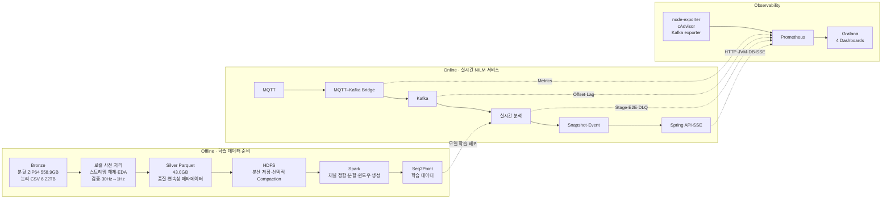

# NILM End-to-End 데이터 플랫폼 구축 및 최적화

- 6.22TB 규모의 30Hz 전력 데이터를 전체 압축 해제 없이 43.0GB의 1Hz Silver Parquet으로 변환
- 제한된 HDFS·Spark 환경에 맞는 배치 처리 구조 설계 및 구현
- Prometheus·Grafana 기반 실시간 관측 체계를 설계 및 구현

## 1. 개요

- 목표
  - Seq2Point 기반 NILM 학습 데이터의 품질·처리 효율 향상
  - 대용량 분할 압축 원본의 일괄 해제로 발생하는 약 6.22TB 저장 공간 요구 제거
  - 로컬에서 고비용 작업을 한 번만 수행한 뒤 HDFS·Spark에는 정형화된 Silver 데이터만 전달
  - MQTT부터 Kafka·실시간 분석·이벤트 발행까지의 처리량, 지연, 오류, 자원 상태 통합 관측
- 성격
  - 최종 모델 입력 생성 이전의 **사전 전처리 계층**
  - Bronze 보존, Silver 재사용, Spark의 역할 분리, 온라인 파이프라인의 운영 가시성 확보

### 핵심 성과

| 지표        |                                              결과 |
| ----------- | ------------------------------------------------: |
| 원본        |       분할 ZIP64 **558.9GB**, 논리 CSV **6.22TB** |
| 전수 분석   |                  CSV **32,395개**, **839.7억 행** |
| Silver 결과 |  Parquet **32,392개**, **27.99억 행**, **43.0GB** |
| 다운샘플링  |                 30Hz → 1Hz, 행 수 **정확히 1/30** |
| 용량 절감   |        CSV 대비 **144.7배 축소**, **99.31% 절감** |
| 처리시간    |            기준선 14.18시간 → 실제 **2시간 20분** |
| 성능 개선   | 기준선 대비 **약 6.1배**, 경과시간 **83.5% 단축** |
| 예상 정확도 |  2.42시간 예상 → 2.33시간 실측, 오차 **약 -3.5%** |
| 변환 품질   |   성공 32,392개, 사전 격리 3개, 신규 실패 **0개** |
| 최종 무결성 |      크기·SHA-256·행 수·스키마·지문 **100% 통과** |
| 관측 체계   |   Prometheus 수집 계층 + Grafana 대시보드 **4종** |

## 2. 전체 아키텍처



### 계층별 책임

| 계층               | 주요 책임                                    | 설계 효과                           |
| ------------------ | -------------------------------------------- | ----------------------------------- |
| Bronze             | 분할 ZIP64 원본 보존                         | 정책 변경·고주파 재분석 가능        |
| 로컬 사전 처리     | 스트리밍 해제, 전수 EDA, 타입 변환, 1Hz 집계 | 전체 압축 해제와 반복 CSV 파싱 제거 |
| Silver             | Typed Parquet, 품질 플래그, 연속 구간        | 재사용 가능한 표준 입력 계층        |
| HDFS               | Silver 분산 저장                             | 네트워크·복제 저장량 대폭 축소      |
| Spark              | 채널 정렬·결합, 데이터 분할, 윈도우 생성     | 분산 연산을 학습 데이터 생성에 집중 |
| Prometheus·Grafana | 온라인 처리량·지연·오류·자원 관측            | 병목과 장애 위치를 단계별로 확인    |

## 3. 전수 EDA와 컬럼 최적화

### 판정 규칙

- `frequency`: 모든 **유효값**이 `60`인지 검사
- `voltage_phase`: 모든 **유효값**이 `0`인지 검사
- `phase_difference`: `current_phase`와 양쪽 모두 유효한 행에서 완전 일치하는지 검사
- `?`, 빈 값 등 결측은 상수의 반례로 간주하지 않고 별도 품질 정보로 집계
- 세 조건을 서로 독립적으로 판정하고, 실패한 검사만 비활성화
- 세 조건이 모두 실패한 경우에만 남은 전수 비교를 조기 종료하도록 설계

### 최종 판정

| 컬럼·검사                           | 전수 분석 결과 | 조치                        | 근거                                   |
| ----------------------------------- | -------------- | --------------------------- | -------------------------------------- |
| `frequency == 60`                   | 실패           | **유지**                    | `36.0` 등 실제 유효 반례 존재          |
| `voltage_phase == 0`                | 통과           | **삭제**                    | 모든 유효 관측값이 0, 결측은 별도 처리 |
| `phase_difference == current_phase` | 통과           | **`phase_difference` 삭제** | 중복 정보 제거, `current_phase` 유지   |

- `frequency` 최초 유효 반례: `H001_ch04_20231010.csv`, 1,061,402행, `36.0`
- 초기 오탐 원인: `?` 또는 파싱 예외를 값 불일치로 취급하던 판정 경로
- 개선: 결측·비정상 숫자와 실제 반례 분리, 원본 행 재검증 후 판정 기록

### 데이터 품질 결과

| 항목                    |                      발견 규모 | 처리 정책                              |
| ----------------------- | -----------------------------: | -------------------------------------- |
| `active_power` 결측     | 130개 파일, 313,458행, 403구간 | 0 대체·임의 보간 없이 NULL과 개수 보존 |
| 복구 불가능 숫자        |                            2셀 | 해당 셀만 NULL, 품질 비트 기록         |
| 파일명·내부 날짜 불일치 |                       3개 파일 | 자동 날짜 변경 없이 격리               |
| 학습 가능 초            |                2,798,658,328초 | 전체 출력의 **99.9996%**               |
| 학습 제외 초            |                       10,472초 | 결측·구조·시간축 기준으로 명시적 제외  |

- 실제 소비전력 `0`과 결측 `NULL` 구분
- 초별 `sample_count`, 컬럼별 `valid_count`, `active_power_min/max` 보존
- 정상 30개 표본과 추가 오류 없음 조건을 만족할 때만 `train_eligible=true`
- 결측·중복·불규칙 간격 전후에서 `segment_id` 분리
- 결측을 제거한 뒤 시간축이 붙어 버리는 잘못된 학습 윈도우 방지
- 평균·최솟값·최댓값은 Float64로 계산, 허용 오차 확인 후 Float32 저장

## 4. 스트리밍 Silver 변환

```text
외장 HDD의 분할 ZIP64
  → ZIP 물리 오프셋 순서로 압축 멤버 읽기
  → NVMe에 소수 압축 멤버만 임시 저장
  → 16개 프로세스에서 ISA-L 스트리밍 해제
  → 8MiB CSV 블록 파싱
  → 하루 86,400초 누적 배열에 벡터 집계
  → ZSTD Level 3 Parquet 저장
```

### 주요 설계 선택

| 문제                          | 적용 전략                               | 효과                                     |
| ----------------------------- | --------------------------------------- | ---------------------------------------- |
| 전체 해제 시 6.22TB 공간 필요 | ZIP 멤버 단위 스트리밍                  | 해제된 CSV 전체를 디스크에 저장하지 않음 |
| 외장 HDD 랜덤 탐색            | ZIP 물리 오프셋 순서 처리               | 순차 읽기 중심으로 I/O 안정화            |
| 같은 디스크 읽기·쓰기 경쟁    | 원본은 외장 HDD, 임시·출력은 NVMe       | HDD는 원본 읽기에 집중                   |
| 대용량 메모리 점유            | 8MiB 블록 + 86,400초 고정 누적 배열     | 메모리가 원본 행 수에 비례하지 않음      |
| DEFLATE·집계 CPU 비용         | ISA-L + 벡터 구간 집계                  | 압축 해제·반복 인덱스 비용 축소          |
| 프로세스·내부 스레드 중첩     | NumPy·Arrow 스레드 1개 제한             | 16프로세스 병렬 처리 안정화              |
| 중단 위험                     | 체크포인트·파일별 성공 기록·원자적 쓰기 | 완료 지점부터 안전하게 재개              |

### Silver 구조

```text
silver_1hz_full/
  house_id=001/
    channel_id=01/
      date=2023-09-25/
        part-00000.parquet
        _SUCCESS.json
```

- 가구·채널·날짜 파티션으로 Spark Partition Pruning 지원
- 파일당 86,400행, 21,600행 단위 Row Group, 고정 24컬럼 스키마
- 품질 비트: 표본 없음, 표본 수 이상, 전력 결측, 숫자 손상, 중복 시각, 간격 이상, 구조 오류
- 평균 파일 약 1.33MB: 파일별 재개·추적에는 유리하나 HDFS에서는 소파일 Compaction 필요

## 5. 속도 측정과 최적화

### 예상시간 신뢰도 개선

| 단계        |                  표본 | 목적                           | 얻은 판단                                          |
| ----------- | --------------------: | ------------------------------ | -------------------------------------------------- |
| 초기 확인   |                   3개 | 실행 가능성과 대략적 범위 확인 | 캐시·파일 위치 영향으로 20~30시간 수준의 넓은 추정 |
| 통제 실험   |             동일 24개 | 구현 변경 A/B 비교             | 벡터 집계·ISA-L·작업자 수 효과 분리                |
| 분산 표본   |             신규 96개 | ZIP 전 구간·크기 편향 완화     | 최종 경로 기준 2.42시간 외삽                       |
| 확장성 검증 |             동일 98개 | 4·8·12·16 작업자 비교          | 16작업자 선택, 결과 동일성 확인                    |
| 이중 외삽   | 파일 수 + 원본 바이트 | 작은 파일·큰 파일 편향 확인    | 운영 예상 범위 3~4시간 확보                        |
| 전체 실행   |              32,395개 | 예측 검증                      | 2.33시간, 예측 오차 약 -3.5%                       |

- 성능·품질 벤치마크에 서로 다른 CSV **314개** 사용
- ZIP의 물리적 위치 8개 구간에서 분산 표본 선택
- 반복 표본은 절대시간보다 동일 입력의 상대 성능 비교에 활용
- 표본 기반 계산값과 장시간 발열·HDD 상태를 반영한 운영 예산을 분리

### 최적화 단계별 실측

| 동일 24개 표본 |    시간 | 기준선 대비 |
| -------------- | ------: | ----------: |
| 기존 1작업자   | 37.82초 |      1.00배 |
| 벡터 구간 집계 | 31.65초 |      1.19배 |
| ISA-L 해제     | 30.48초 |      1.24배 |
| 2작업자        | 16.66초 |      2.27배 |
| 4작업자        |  9.57초 |      3.95배 |
| 8작업자        |  6.65초 |      5.69배 |
| 12작업자       |  5.72초 |      6.61배 |

### 최종 작업자 선택

| 작업자 | 동일 98개 경과시간 | 평균 논리 코어 환산 |
| -----: | -----------------: | ------------------: |
|      4 |            40.26초 |                4.47 |
|      8 |            27.65초 |                8.78 |
|     12 |            22.11초 |               12.36 |
| **16** |        **19.00초** |           **15.12** |

- 4→16 작업자: **2.12배 가속**, 경과시간 **52.8% 단축**
- 작업자 수와 무관하게 값·NULL·품질 플래그 동일
- 신규 96개도 16작업자로 25.82초에 처리해 반복 캐시 편향 완화
- 전체 실행 평균 CPU: 논리 코어 13.70개, 22개 기준 약 62.3%
- 외장 HDD 스트리밍과 프로세스 간 부하 편차로 CPU 100%가 목표는 아니며, 낮은 메모리는 고정 크기 누적 배열 설계의 결과

### EDA 전수 스캔 운영 성능

| 구간                 |                                  처리량 |
| -------------------- | --------------------------------------: |
| 초기 연속 구간       |  10,500개 / 1.26시간 ≈ **8,333개/시간** |
| 자동 복구 후 주 구간 | 20,728개 / 9,970.7초 ≈ **7,484개/시간** |
| 최종 상태            |           **32,395개 완료**, 미완료 0개 |

## 6. 장시간 배치 안정성과 무결성

| 장치                    | 역할                               |
| ----------------------- | ---------------------------------- |
| `_CONFIG.json`          | 코드·정책·원본 파트의 실행 지문    |
| `_conversion.lock`      | 동일 출력 경로의 중복 실행 차단    |
| 임시 파일 + 원자적 변경 | 미완성 파일의 정상 결과 노출 방지  |
| `_SUCCESS.json`         | 파일별 행 수·크기·SHA-256·처리시간 |
| `_quarantine/*.json`    | 제외 파일과 판단 근거 보존         |
| `_PROGRESS.json`        | 약 30초 간격 진행률·ETA·성공·실패  |
| `_logs/*.jsonl`         | 파일별 결과와 실행 이벤트 누적     |
| `_RUN_SUMMARY.json`     | 전체 실행과 작업자 활동 요약       |

- 완료 파일의 크기·SHA-256을 확인한 뒤 건너뛰는 재개 방식
- 비정상 종료 시 감시 프로세스가 오류 원인을 남기고 체크포인트에서 자동 재시작
- 코드·설정 지문 불일치 시 기존 결과 혼합 전에 중단
- 파일 단위 실패 격리로 일부 손상이 전체 배치를 중단시키지 않도록 구성
- 전체 변환 중 신규 실패 없이 16개 작업자 유지
- 전체 43GB 재읽기 검증: 32,392개 파일, 행 수, 24컬럼 스키마, SHA-256, 실행 지문 오류 **0개**
- 사후 전수 검증 시간: 약 **84초**

## 7. HDFS·Spark 도입

### 처리 구조 변경의 배경

| 초기 구상                                     | 변경 구조                                                        |
| --------------------------------------------- | ---------------------------------------------------------------- |
| 압축 원본 → CSV → HDFS → Spark 정제 → Parquet | 압축 원본 → 로컬 스트리밍 Silver → HDFS → Spark 학습 데이터 생성 |
| 약 6.22TB CSV 전송·저장                       | 43.0GB Typed Parquet 전송                                        |
| Executor마다 문자열 파싱·품질 판단 반복       | 로컬에서 1회 수행한 스키마·품질 정보 재사용                      |
| Spark가 압축 해제와 정제까지 담당             | Spark는 정합·결합·분할·윈도우에 집중                             |

- 외부 네트워크 실측 약 80~100Mbps와 제한된 저장 공간을 고려한 전처리 위치 변경
- 초기 채널 검증: CSV 6.03GiB → Parquet 0.99GiB
- 최종 실측: 변환 대상 CSV 6.222TB → Silver 43.008GB
- HDFS Replication 3 가정 시 약 129GB로, 원본 CSV 적재 대비 현실적인 저장 규모

### 외부 분산 환경 검증

```text
Node 1   HDFS NameNode + DataNode + Spark Master + Worker
Node 2~4 HDFS DataNode + Spark Worker
Network  Tailscale 기반 4-PC 연결
```

- HDFS 분산 저장과 Spark Worker의 Task 참여 확인
- CPU·메모리·Disk I/O·Network 및 Worker별 처리 편차 점검
- Spark 역할
  - HDFS 전체 스키마·품질 검증
  - 가구별 mains/appliance 채널 시간 정렬과 결합
  - train/validation/test 우선 분리와 통계 누수 방지
  - `train_eligible`, `segment_id` 기반 연속 학습 윈도우 생성
  - Worker 수에 따른 처리시간·자원 효율 비교

### 현재 재현 가능 범위

| 구성               | 현재 상태                              | 저장소 재현성                |
| ------------------ | -------------------------------------- | ---------------------------- |
| Prometheus·Grafana | 환경별 Compose·계측·대시보드 구현      | **가능**                     |
| HDFS               | NameNode·DataNode·Kafka→Parquet Loader | **로컬 단일 노드 실험 가능** |
| Spark              | 외부 4-PC 클러스터 구축·검증           | **저장소만으로는 불가능**    |

- 현재 저장소에 Spark Master/Worker Compose와 Spark Job 코드 없음
- 로컬 HDFS는 단일 DataNode·Replication 1로 외부 4노드 환경과 구분
- HDFS Loader 기본 토픽 `power-raw`와 로컬 표준 `power.raw.v1` 정합 필요
- 일 단위 약 1.33MB 파일은 HDFS 적재 전후 월 단위 128~256MB Compaction 검증 필요

## 8. Prometheus·Grafana 관측 체계

### 구성 원칙

- `infrastructure/observability`의 별도 `nilm-observability` Compose 프로젝트
- 업무 스택 `nilm-local`, `nilm-a`, `nilm-b`와 생명주기·데이터 볼륨 분리
- 기존 local/A/B Compose 원본 대신 환경별 Override로 계측 활성화
- `OBSERVABILITY_ENABLED=true`일 때만 애플리케이션 Metrics 노출
- 가구 ID·메시지 ID를 Label에서 제외해 고카디널리티와 식별정보 노출 방지

### 계측 범위

| 대상              | 주요 지표                                                         |
| ----------------- | ----------------------------------------------------------------- |
| MQTT–Kafka Bridge | MQTT 수신, 유효성 오류, Kafka ACK 성공·실패, 전달 지연, 구독 상태 |
| Kafka             | Topic 입력·소비 Offset, Consumer Lag, Lag 해소 추정               |
| 실시간 분석       | 처리·실패·DLQ, 단계별 시간, Snapshot·Event 발행, E2E 지연         |
| Spring 서비스     | HTTP 요청·오류·지연, JVM Heap·GC, HikariCP, SSE 연결              |
| 호스트·컨테이너   | CPU, 메모리, 디스크, 네트워크                                     |

### Grafana 대시보드

| 대시보드                          | 관찰 질문                                  |
| --------------------------------- | ------------------------------------------ |
| `NILM 1 · 전력 데이터 파이프라인` | 어느 단계에서 처리량이 줄어드는가?         |
| `NILM 2 · 지연과 Kafka Lag`       | p50/p95/p99 지연과 적체가 얼마나 되는가?   |
| `NILM 3 · 서비스 상태`            | HTTP·JVM·DB Pool·SSE·DLQ가 정상인가?       |
| `NILM 4 · 호스트와 컨테이너 용량` | EC2-A/B와 컨테이너의 자원 병목은 어디인가? |

- E2E 정의: **전력 측정 시각 → 분석 Snapshot의 Kafka 저장 ACK**
- 브라우저 렌더링 시간은 E2E에서 제외
- `UP`은 Metrics Endpoint 접근 가능 상태이며 업무 처리 성공과 동일하지 않음
- Kafka 입력·소비율은 Offset 변화량 기반 추정
- Lag ETA는 순해소율이 0보다 클 때만 표시
- 트래픽·오류·GC가 없을 때 일부 `No data`는 정상
- 로컬 Windows 호스트 지표는 Windows 본체가 아닌 Docker Linux VM 기준

## 9. 구현 상태와 후속 과제

| 영역              | 확보한 결과                                    | 다음 단계                                                    |
| ----------------- | ---------------------------------------------- | ------------------------------------------------------------ |
| 데이터 품질       | 839.7억 행 전수 EDA, 컬럼 제거 근거, 격리 정책 | 채널 메타데이터와 단위 확정                                  |
| Silver 파이프라인 | 32,392개·43.0GB 실제 변환, 무결성 100%         | 정책 변경 시 Bronze 기반 재실행                              |
| HDFS              | 경량 Silver 적재 전략, 로컬 Compose            | Replication·Block Size·Compaction 실측                       |
| Spark             | 외부 4-PC 클러스터와 역할 검증                 | 버전 고정, Compose/Job, `spark-submit`, 재시도 정책 저장소화 |
| Observability     | 서비스·호스트·Kafka 계측과 대시보드 4종        | Spark Metrics/JMX 연동                                       |
| 성능 검증         | 다단계 표본·이중 외삽, 실제 오차 -3.5%         | Spark Worker 1/2/4대 동일 입력 벤치마크                      |

> 현재 Prometheus는 온라인 서비스와 인프라 지표를 수집하지만 Spark의 Stage·Executor·Task·Shuffle 내부 지표는 미연동 상태. 컨테이너 자원은 cAdvisor로 확인 가능하나 Spark 내부 병목 분석에는 Metrics System 또는 JMX Exporter 추가 필요.

## 10. 포트폴리오 관점의 기술적 기여

- **대용량 처리**: 558.9GB 분할 압축·6.22TB 논리 CSV를 완전 해제 없이 스트리밍 처리
- **정량적 최적화**: 동일 표본 A/B, ZIP 전 구간 분산 표본, 파일 수·바이트 이중 외삽으로 개선 효과 검증
- **예측 검증**: 2.42시간 예상과 2.33시간 실측의 차이를 -3.5%로 제한
- **저장 효율**: 6.22TB CSV를 품질 메타데이터 포함 43.0GB Parquet으로 축소
- **학습 품질**: 결측·실제 0·불규칙 간격을 구분하고 연속 구간 기반 윈도우 정책 수립
- **장시간 운영**: 체크포인트, 자동 재개, 오류 격리, 원자적 쓰기, SHA-256 전수 검증 적용
- **분산 처리 설계**: 제한된 HDFS·Spark 환경에 적합하도록 고비용 전처리를 로컬 Silver 계층으로 이동
- **관측 가능성**: MQTT→Kafka→분석→API 구간의 처리량·지연·Lag·오류·자원을 4개 대시보드로 통합
- **비용 통제**: 고카디널리티 Label 제외, 관측 스택 분리, Parquet Projection·Partition Pruning 기반 스캔 절감

## 11. 주요 산출물

- [`convert_to_1hz_streaming.py`](./convert_to_1hz_streaming.py): 분할 ZIP 스트리밍 1Hz Parquet 변환
- [`run_ts_scan_supervisor.py`](./run_ts_scan_supervisor.py): 체크포인트 기반 전수 EDA 자동 복구
- [`NILM_PARQUET_STRATEGY.md`](./NILM_PARQUET_STRATEGY.md): Silver 변환·품질 정책
- [`NILM_OPTIMIZATION_RESULT.md`](./NILM_OPTIMIZATION_RESULT.md): 성능 최적화 실험 결과
- [`NILM_DATA_PIPELINE_PORTFOLIO_REPORT.md`](./NILM_DATA_PIPELINE_PORTFOLIO_REPORT.md): 전수 분석 및 초기 설계 상세

---

### 한 줄 요약

> 6.22TB 규모의 30Hz NILM 데이터를 전체 압축 해제 없이 전수 검증·다운샘플링해 43.0GB의 품질 추적형 Silver Parquet으로 변환하고, 제한된 HDFS·Spark 배치 계층과 Prometheus·Grafana 기반 실시간 관측 체계를 연결한 End-to-End 데이터 플랫폼 구축
