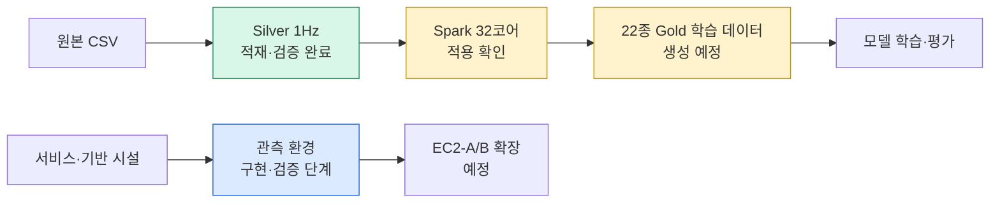
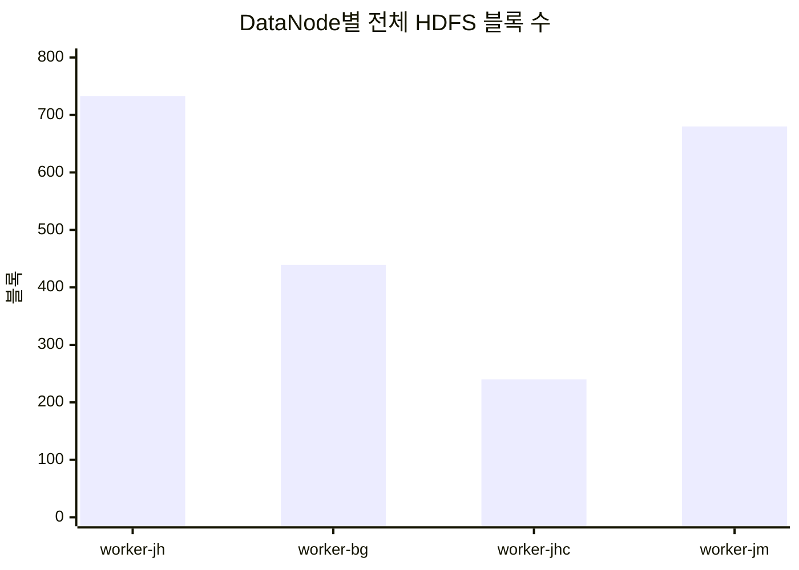
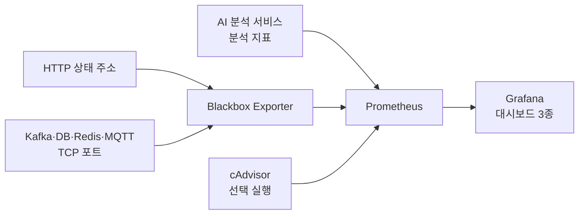

# NILM 데이터 파이프라인·관측 환경 진행 상황

## 1. 현황

| 영역               | 상태                  | 핵심 결과                                         | 다음 작업                  |
| ------------------ | --------------------- | ------------------------------------------------- | -------------------------- |
| Silver 1Hz 적재    | **완료**              | 79가구·1,045채널·약 28억 행 HDFS 게시             | 재적재 없이 읽기 전용 사용 |
| Silver 무결성 검증 | **완료**              | 업로드 실패·손상·유실·복제 부족 블록 0            | Gold 입력 조건 유지        |
| Spark 자원 확장    | **설정안 확정**       | Worker 4대·최대 32코어 구성                       | 각 노트북 반영값 확인      |
| Gold 생성          | **설정 완료·실행 전** | 22종 가전·966개 연결의 공통 학습 데이터 구성 확정 | 실행 전 환경 확인 후 생성  |
| 관측 환경          | **구현·검증 단계**    | Prometheus·Grafana·Blackbox 구성, 대시보드 3종    | 로컬 확인 후 EC2-A/B 확장  |



## 2. Silver 1Hz 적재 결과

### 핵심 수치

| 항목            |            결과 |
| --------------- | --------------: |
| 가구            |          79가구 |
| 채널 파일       |         1,045개 |
| 전체 행         | 2,798,928,000행 |
| 학습 가능 행    | 2,798,915,831행 |
| 논리 용량       |       약 36.6GB |
| 복제 계수       |               2 |
| 적재 시간       |  5시간 1분 22초 |
| Spark 전수 검증 |        4분 25초 |
| 실패 작업       |             0개 |

### 저장·검증 방식

- 경로: `/nilm/silver_1hz/house_id=<가구>/channel_id=<채널>/part-00000.parquet`
- 날짜별 작은 파일 31개 → 채널별 파일 1개로 병합
- 임시 경로 업로드 → 크기·SHA-256 확인 → 복제 계수 2 적용 → `fsck` 통과 후 게시
- 원본 CSV와 로컬 Silver 유지
- 중단 시 검증 완료 파일을 건너뛰는 재개 방식 적용

### DataNode 분포



| 노드         | 상태 | HDFS 사용량 | 전체 블록 |
| ------------ | ---- | ----------: | --------: |
| `worker-jh`  | 정상 |     24.23GB |       733 |
| `worker-bg`  | 정상 |     14.25GB |       439 |
| `worker-jhc` | 정상 |      7.98GB |       240 |
| `worker-jm`  | 정상 |     22.26GB |       680 |

- 노드별 용량·연결 시점 차이로 분포 편차 존재
- 손상·유실·복제 부족 없음 → 현재 안정성 문제 없음
- 편차 확대 시 유휴 시간에 HDFS Balancer 검토
- 위 사용량·블록 수에는 Spark 이벤트 로그 등 다른 HDFS 데이터 포함

## 3. Gold 학습 데이터 생성 계획

### 확정 범위

| 항목             |                                       값 |
| ---------------- | ---------------------------------------: |
| 대상 가전        |                  라벨이 확인된 22종 전체 |
| 분전반 채널      |                                     79개 |
| 분전반–가전 연결 |                                    966개 |
| 학습 가구        |                                   55가구 |
| 검증 가구        |                                   11가구 |
| 시험 가구        |                                   13가구 |
| 최대 후보 행     |                          2,587,334,400행 |
| 출력 경로        | `/nilm/gold/all_appliances_seq2point_v1` |

- 최대 후보 행: `966개 연결 × 2,678,400초`
- 실제 행: 품질 기준과 시각 정합을 통과하므로 최대 후보보다 적음
- 가장 적은 식기세척기도 학습 9·검증 3·시험 3개 연결 확보

### 학습 데이터 기준

| 구분        | 적용 내용                                                                |
| ----------- | ------------------------------------------------------------------------ |
| 대상        | 라벨에 존재하는 22종 가전 전체                                           |
| 입력        | 분전반 `active_power`                                                    |
| 정답        | 개별 가전 `active_power`                                                 |
| 유효 행     | 양쪽 `train_eligible=true`, `segment_id` 존재, 값 존재, `valid_count=30` |
| 시각 정합   | 분전반·가전 `timestamp` 내부 조인                                        |
| 연속 구간   | 시각 차이가 1초가 아니면 `segment_id` 재생성                             |
| 데이터 분할 | 전체 가전 공통 가구 단위 70/15/15: 55/11/13가구                          |
| 분할 검증   | 22종 모두 학습·검증·시험에 1개 이상 포함                                 |
| 정규화      | 가전별 학습 분할의 입력·정답 통계만 사용                                 |
| 입력 구간   | 599초, 간격 1초, 학습 로더에서 생성                                      |
| 저장        | Parquet ZSTD, 가전·분할별 파티션                                         |
| 완료 검증   | 966개 연결 모두 599초 이상 연속 구간 보유                                |
| 게시        | 임시 경로 완성·검증 후 최종 경로로 이동                                  |


### 중요 원칙

- 채널 번호만으로 가전 종류 추정 금지
- AI-Hub 라벨의 `meta.name`, `meta.id`, `labels.id` 기준으로 연결
- Silver 1,045개 채널과 라벨 JSON 32,395개 전수 대조 완료
- 라벨 누락·가구별 분전반 수·22종 영문 분할명 검사 완료
- 위 검증 결과를 반영한 `configs/gold.json` 생성 완료
- 날짜별 기기명이 충돌하는 채널 제외
- 같은 가구는 모든 가전에서 하나의 분할만 사용
- 검증·시험 데이터가 정규화 통계에 섞이지 않도록 차단

### 예정 출력

```text
/nilm/gold/all_appliances_seq2point_v1/
├── series/          # 가전·분할별 시계열 입력과 정답
├── segments/        # 연속 구간과 생성 가능 윈도 수
├── normalization/   # 가전별 학습 분할 통계
├── statistics/      # 가전·분할별 행·연결·구간·윈도 수
├── pairs/           # 966개 채널 연결 정보
├── catalog/         # 22종 가전명·영문명·분할별 연결 수
└── manifest/        # 입력·정책·스키마·설정 검증값
```

- `series`, `segments`: `appliance_slug`와 `split`로 분할 저장
- 원하는 가전·분할만 읽어 불필요한 데이터 탐색 방지
- 채널·가전 정보는 `pairs`에 분리해 시계열 중복 저장 방지
- 윈도는 같은 `pair_id/segment_id` 안에서만 생성

## 4. Spark 실행 자원

| 구분                |     Worker 1대 | 4대 합계 |
| ------------------- | -------------: | -------: |
| WSL 인식 CPU        |         12코어 |   48코어 |
| Spark 사용 CPU      |          8코어 |   32코어 |
| WSL 메모리          |           10GB |     40GB |
| Spark Worker 메모리 |            6GB |     24GB |
| Executor            | 4코어·3GB, 2개 |      8개 |

- Master: Driver·NameNode 전담, Worker 중지
- Driver: 4GB
- 최대 사용 코어: 32
- 남는 자원: Worker별 CPU 4코어, Windows 메모리 약 6GB
- Gold 실행 전 확인값: Worker 4대, 전체 32코어, Worker별 8코어·6GB
- Shuffle 파티션: 512
- 가전·분할별 파일 묶음: 최대 8개, 파일당 최대 8,000,000행
- 966개 연결 정보는 전체 Worker에 배포하고, 필요한 Silver 컬럼만 조회
- 전체 가전을 하나의 실행 계획으로 처리해 가전별 반복 연산 방지
- 실행 중 Worker 설정 변경·프로세스 재시작 금지

## 5. 관측 환경 구현 현황

### 구성



| 구성 요소         | 현재 역할                                       |
| ----------------- | ----------------------------------------------- |
| Prometheus        | 15초 간격 수집, 15일·최대 5GB 보존              |
| Grafana           | 데이터소스와 대시보드 자동 등록                 |
| Blackbox Exporter | HTTP 준비 상태·응답시간·상태 코드·TCP 연결 확인 |
| cAdvisor          | 컨테이너 CPU·메모리·통신량 수집, 기본 비활성    |

### 대시보드와 판단 기준

| 화면          | 주요 확인 항목                                                 | 활용                          |
| ------------- | -------------------------------------------------------------- | ----------------------------- |
| 서비스 가용성 | 수집 상태, HTTP/TCP 성공, 응답시간·코드                        | 서비스·네트워크 장애 구분     |
| AI 분석       | 처리량, 단계별 지연, E2E 지연, Kafka 적체, DLQ·오류, 모델 버전 | 병목·입력 품질·배포 영향 확인 |
| 컨테이너 자원 | CPU·메모리·통신량                                              | 자원 부족·누수 징후 확인      |

- AI 분석 서비스 `/metrics`, `/health`, `/ready` 활용
- 지연: 단계별 평균·p95, 전체 p50·p95·p99 확인
- Kafka: 파티션별 적체량과 처리량 함께 비교
- 오류: DLQ 사유와 처리 단계·예외 종류로 구분
- `up`: Prometheus의 수집 성공 여부
- `probe_success`: Blackbox Exporter의 실제 대상 검사 성공 여부

### 현재 제한

- AI 외 서비스의 내부 업무 지표 없음
- TCP 검사는 연결 가능 여부만 확인
- E2E 지연에 Kafka 발행 확인 이후 시간 미포함
- Kafka 적체량은 반영 완료 위치가 아닌 현재 처리 위치 기준
- 알림 규칙·외부 알림 전송 미구성
- cAdvisor 기본 비활성

## 6. 다음 작업

| 우선순위 | 작업                | 완료 기준                                                |
| -------: | ------------------- | -------------------------------------------------------- |
|        1 | Gold 실행 환경 확인 | Worker 4대·32코어, DataNode 4대, Master Worker 중지 확인 |
|        2 | 기존 출력 경로 확인 | 최종 경로와 `_staging` 경로 모두 미존재                  |
|        3 | Gold 생성 실행      | `/nilm/gold/all_appliances_seq2point_v1` 게시            |
|        4 | Gold 결과 검증      | 22종·966개 연결, 분할·구간·정규화·통계 확인              |
|        5 | 관측 환경 로컬 확인 | 수집 대상 정상, 대시보드 3종 데이터 표시                 |
|        6 | EC2-A/B 확장        | 사설망 수집 경로·보안 그룹·환경별 대상 확인              |
|        7 | 운영 보강           | 서비스 중단·적체·지연·오류 알림 추가                     |

## 7. 요약

- Silver 적재·전수 검증 완료 → 재업로드 불필요
- Gold는 검증된 `/nilm/silver_1hz`를 읽기 전용 입력으로 사용
- Gold 설정 완료: 22종 가전·966개 연결·79가구 공통 분할
- Gold 실행 전 Spark 32코어·DataNode 4대·출력 경로 미존재 확인 필수
- 채널 번호 추정 연결 금지 → 잘못된 정답 학습 방지
- 기존 Gold 또는 불완전한 임시 결과와 혼합·자동 덮어쓰기 금지
- 관측 환경은 로컬 확인 후 EC2-A/B로 확장
- 현재 최우선 과제: **실행 환경 확인 → Gold 22종 생성 → 결과 검증**
