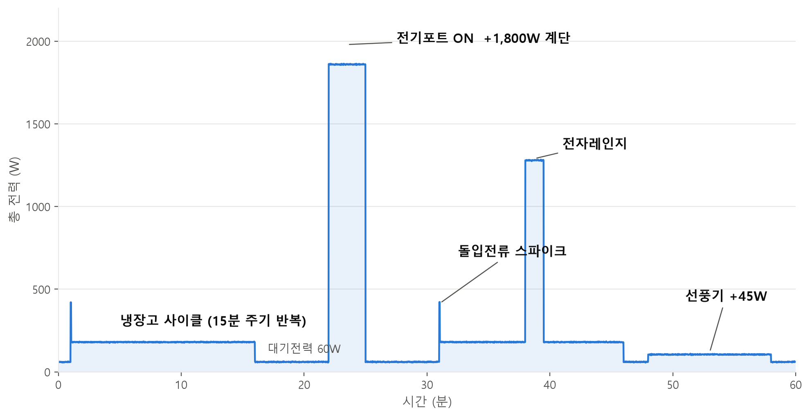

# 진행 상황 회고 (0902, 채지현)

## 오늘 한 일

### 1. 분산 인프라 도커 스택 프로토타입 이관 (`feature/kafka/replay-simulator`)

- 개인 프로토타입(wattsup)에서 검증한 Kafka·HDFS·MQTT 스택을 팀 컨벤션(`nilm-*` 컨테이너명, `nilm-net` 외부 네트워크)으로 이식
  - Kafka (KRaft 단일 노드, apache/kafka 3.9.0, :9092) + Kafka UI (:8089 — 8081은 iot-device-service가 사용 중)
  - HDFS NameNode (:9870 UI, :9000 RPC) + DataNode (:9864), 복제 계수 1
  - Mosquitto (:1883, 개발용)
- 검증
  - Kafka: 10가구 리플레이 → 유실 0, 가구별 균등 수신, 파티션 8개 중 7개 사용, 동일 가구 = 동일 파티션
  - HDFS: `/data/raw`·`/data/stream`·`/data/processed`·`/data/events` 4개 디렉토리 생성, put/get 왕복 성공, Live datanodes 1
  - MQTT: `home/H001/power` pub → `home/+/power` sub 왕복 성공
- 같은 시간대에 팀원이 `infrastructure/docker-compose.yml`에 Kafka·Kafka UI·mosquitto를 올려서 
역할이 겹침
  → 스택 compose(`bigdata/compose.yaml`)는 병합에서 제외하고 **리플레이 시뮬레이터만 병합**. HDFS는 내일 별도 compose로 분리 예정

### 2. 다가구 전력 리플레이 시뮬레이터 구현 (`infrastructure/kafka/replay/producer.py`)

- **합성 모드(기본)**: 가구별 상태머신으로 분전반(Main) 총전력 생성
  - 대기전력 60W + 가우시안 노이즈(σ 2W)
  - 냉장고 사이클: 120W, 15분 운전 / 30분 휴지, 기동 1.5초 동안 돌입전류 3배. 가구마다 위상을 다르게 시작
  - 랜덤 가전 이벤트: 전기포트 1,800W(2~4분) · 전자레인지 1,100W(0.5~3분) · 선풍기 45W(10~60분), 시간당 발생 확률을 dt 기준으로 환산
  - 시드 고정(42)으로 재현 가능
- **CSV 모드(`--csv`)**: `timestamp,house,power_w` 실데이터를 원본 시간 간격으로 재생
- 공통 옵션: `--houses`, `--hz`(가구당 초당 측정 횟수), `--speed`(배속), `--bootstrap`
- 메시지 key = 가구 ID → 같은 가구는 항상 같은 파티션 (순서 보장, 하류 컨슈머 수평 확장 기반)
- 합성 파형 1시간 예시 (계단·스파이크가 계단 감지 알고리즘 테스트 재료가 됨)

  

### 3. 수신 검증 도구 (`consumer_check.py`)

- `power-raw`를 N초 소비해서 총 건수·초당 처리량, 가구별 수신 건수, 파티션별 분배를 출력
- 매번 새 group.id를 써서 최신 오프셋부터만 읽음 (기존 컨슈머 그룹 오프셋 오염 방지)
- 유실·편중·파티션 고정 여부를 숫자로 바로 확인하는 용도

### 4. 메시지 스키마를 MQTT 시뮬레이터와 통일

- `ts`: epoch float → **ISO 8601 UTC 밀리초** (`2026-09-02T08:36:00.123Z`)
- `device` 필드 추가 (현재 `"main"` 고정)
- 최종 스키마: `{house, device, ts, power_w}`
- 이유: 브릿지 경로(MQTT → Kafka)와 리플레이 경로(Kafka 직접 발행)의 데이터 형식이 같아야 적재기·분석 서비스가 하나의 파서로 두 경로를 모두 처리할 수 있음

### 5. 저장소 구조 정리

- `bigdata/replay/` → `infrastructure/kafka/replay/`로 이동 (팀 폴더 컨벤션에 맞춤)
- `feature/kafka/replay-simulator` → `develop` MR 병합

## 트러블슈팅

- **Docker Desktop "unexpected error"로 기동 실패 (교육장 PC 공통)**: 강제 로그오프가 남긴 유닉스 소켓 찌꺼기가 원인. `%LOCALAPPDATA%\Docker\run` 폴더를 rename 후 재기동하면 해결. **Reset to factory defaults는 볼륨이 전부 날아가므로 금지**
- **Kafka `advertised.listeners cannot use 0.0.0.0`**: apache/kafka 이미지는 바인드 주소를 `//:포트` 빈 호스트 형식으로 써야 함
- **Kafka UI 포트 충돌**: 8081이 iot-device-service와 겹쳐 8089로 변경

## 배운 점

- 파티션 키를 가구 ID로 잡는 것 하나로 "가구 단위 순서 보장"과 "컨슈머 수평 확장" 두 가지를 동시에 얻는다. 계단 감지처럼 시간 순서가 중요한 알고리즘에는 필수 조건
- 시뮬레이터는 "그럴싸한 값"보다 **실물 경로와 같은 스키마·주기**를 먼저 맞추는 것이 중요하다. 그래야 시뮬레이터로 검증한 하류 코드를 실물 센서에 그대로 쓸 수 있음
- 같은 인프라를 두 사람이 따로 올리면 compose가 충돌한다. 인프라 변경은 먼저 develop 상태를 확인하고 겹치는 컨테이너는 한쪽에 합치기

## 이슈 / 결정 필요

- [ ] **Kafka 토픽명 불일치**: 브릿지 `power.raw.v1` (파티션 3) vs 리플레이 `power-raw` (파티션 8). 둘 중 하나로 통일 필요
- [ ] `KAFKA_AUTO_CREATE_TOPICS_ENABLE=false`라 토픽을 미리 만들어야 함 → 생성 절차를 스크립트나 README로 남길 것

## 내일 할 일

- [ ] HDFS(NameNode·DataNode)를 별도 compose로 분리해 `nilm-net`에 합류
- [ ] Kafka → HDFS Parquet 적재 잡 (house/date 파티션, 1분 플러시, at-least-once) — MVP DoD
- [ ] 토픽명 통일 협의
