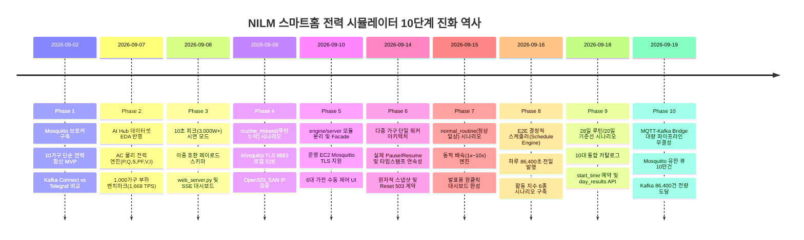

# NILM IoT 스마트홈 전력 시뮬레이터 개발 백서 & A to Z 종합 기술 가이드

> **문서 버전**: v2.1.0
> **최종 갱신일**: 2026-09-23
> **작성자**: 최준혁 (Data / Pipeline Engineer)  
> **문서 대상**: 데이터 엔지니어, AI 모델 연구원, 백엔드/인프라 개발자, 프로젝트 평가위원  
> **문서 목적**: 스마트홈 메인 분전반(Smart Meter) IoT 전력 시뮬레이터의 물리 모델, 실행 경로, 시나리오, 운영 방법과 검증 이력을 정리함. 9월 19일까지의 개발 기록에 9월 20~22일의 센서 고장·안전 배속·웹 UI 변경 사항을 반영함.

---

## 목차 (Table of Contents)

- [NILM IoT 스마트홈 전력 시뮬레이터 개발 백서 & A to Z 종합 기술 가이드](#nilm-iot-스마트홈-전력-시뮬레이터-개발-백서--a-to-z-종합-기술-가이드)
  - [목차 (Table of Contents)](#목차-table-of-contents)
  - [현재 구현 기준 빠른 안내 (2026-09-23)](#현재-구현-기준-빠른-안내-2026-09-23)
  - [1. 시뮬레이터 개요 및 필요성 (Why Simulator?)](#1-시뮬레이터-개요-및-필요성-why-simulator)
    - [1.1 프로젝트 배경: NILM과 독거노인 이상 징후 감지](#11-프로젝트-배경-nilm과-독거노인-이상-징후-감지)
    - [1.2 실물 센서 및 하드웨어 인프라의 현실적 한계](#12-실물-센서-및-하드웨어-인프라의-현실적-한계)
    - [1.3 초기 단순 난수 생성기의 치명적 결함과 교류 물리 법칙의 부재](#13-초기-단순-난수-생성기의-치명적-결함과-교류-물리-법칙의-부재)
    - [1.4 희귀 이상치(Anomaly) 데이터의 결정론적 재현 필요성](#14-희귀-이상치anomaly-데이터의-결정론적-재현-필요성)
    - [1.5 대규모 분산 파이프라인(1,000가구) 스트레스 테스트 환경 확보](#15-대규모-분산-파이프라인1000가구-스트레스-테스트-환경-확보)
    - [1.6 발표 및 평가 시연을 위한 원클릭 인터랙티브 제어 환경 구축](#16-발표-및-평가-시연을-위한-원클릭-인터랙티브-제어-환경-구축)
  - [2. 시뮬레이터 10단계 개발 타임라인 (Development Timeline)](#2-시뮬레이터-10단계-개발-타임라인-development-timeline)
    - [Phase 1 (09/02): Mosquitto 구축 및 10가구 단순 전력 합산 MVP](#phase-1-0902-mosquitto-구축-및-10가구-단순-전력-합산-mvp)
    - [Phase 2 (09/07): AC 물리 엔진 구축 및 1,000가구 벤치마크 실측](#phase-2-0907-ac-물리-엔진-구축-및-1000가구-벤치마크-실측)
    - [Phase 3 (09/08): 10초 피크(3,000W+) 시연 및 경량 웹 서버 구축](#phase-3-0908-10초-피크3000w-시연-및-경량-웹-서버-구축)
    - [Phase 4 (09/09): 08:10 루틴 누락(routine_missed) 및 로컬 TLS E2E](#phase-4-0909-0810-루틴-누락routine_missed-및-로컬-tls-e2e)
    - [Phase 5 (09/10): engine/server 패키지 분리 및 운영 EC2 TLS 8883 지원](#phase-5-0910-engineserver-패키지-분리-및-운영-ec2-tls-8883-지원)
    - [Phase 6 (09/14): 다중 가구 단일 워커, 실제 Pause/Resume, 원자적 스냅샷](#phase-6-0914-다중-가구-단일-워커-실제-pauseresume-원자적-스냅샷)
    - [Phase 7 (09/15): H001 정상 일상(normal_routine), 배속(Speed Multiplier) 엔진, 발표용 UI](#phase-7-0915-h001-정상-일상normal_routine-배속speed-multiplier-엔진-발표용-ui)
    - [Phase 8 (09/16): E2E 결정적 스케줄러 및 활동 지수 6종 시나리오 구축](#phase-8-0916-e2e-결정적-스케줄러-및-활동-지수-6종-시나리오-구축)
    - [Phase 9 (09/17 ~ 09/18): 다일 시나리오(28일 루틴/20일 기준선), 발행 예약(start_time), 일자별 결과 API 구현](#phase-9-0917--0918-다일-시나리오28일-루틴20일-기준선-발행-예약start_time-일자별-결과-api-구현)
    - [Phase 10 (09/19): MQTT-Kafka Bridge 대량 데이터(BURST 86,400건) 파이프라인 무결성 검증 및 병목 최적화](#phase-10-0919-mqtt-kafka-bridge-대량-데이터burst-86400건-파이프라인-무결성-검증-및-병목-최적화)
  - [3. 물리 엔진 및 교류 전력 수학 모델링](#3-물리-엔진-및-교류-전력-수학-모델링)
    - [3.1 교류(AC) 회로 이론 및 다변량 물리 수식](#31-교류ac-회로-이론-및-다변량-물리-수식)
    - [3.2 계측 전압 변동(AR-1) 및 상시 대기전력(Random Walk) 모델](#32-계측-전압-변동ar-1-및-상시-대기전력random-walk-모델)
    - [3.3 주기 가전(냉장고 컴프레서) 서모스탯 듀티 사이클](#33-주기-가전냉장고-컴프레서-서모스탯-듀티-사이클)
    - [3.4 6대 타겟 수동 가전 FSM 및 기동 돌입전류(Inrush) 감쇠 모델](#34-6대-타겟-수동-가전-fsm-및-기동-돌입전류inrush-감쇠-모델)
    - [3.5 6대 가전 전기적 파라미터 종합 비교표](#35-6대-가전-전기적-파라미터-종합-비교표)
  - [4. 시스템 아키텍처 및 핵심 메커니즘](#4-시스템-아키텍처-및-핵심-메커니즘)
    - [4.1 엔드투엔드 데이터 파이프라인 흐름](#41-엔드투엔드-데이터-파이프라인-흐름)
    - [4.2 시뮬레이터 내부 모듈 패키지 구조](#42-시뮬레이터-내부-모듈-패키지-구조)
    - [4.3 단일 워커 루프(Single Worker Loop) 기반 다중 가구 스케줄링](#43-단일-워커-루프single-worker-loop-기반-다중-가구-스케줄링)
    - [4.4 동시성 및 계층 락 구조](#44-동시성-및-계층-락-구조)
    - [4.5 실제 Pause/Resume 구현 원리 및 타임스탬프 연속성 보장](#45-실제-pauseresume-구현-원리-및-타임스탬프-연속성-보장)
    - [4.6 원자적 상태 스냅샷 격리 (`copy.deepcopy`) 및 Batch Commit](#46-원자적-상태-스냅샷-격리-copydeepcopy-및-batch-commit)
    - [4.7 Reset 실패 계약 및 방어적 복구 설계 (HTTP 503 `RESET_FAILED`)](#47-reset-실패-계약-및-방어적-복구-설계-http-503-reset_failed)
    - [4.8 가상 시각(Virtual Time) 엔진 및 우선순위 충돌 방어 규칙 (규칙 A ~ G)](#48-가상-시각virtual-time-엔진-및-우선순위-충돌-방어-규칙-규칙-a--g)
    - [4.9 배속(Speed Multiplier) 엔진 및 가상 시각 불변성 (+1.0초 보존)](#49-배속speed-multiplier-엔진-및-가상-시각-불변성-10초-보존)
    - [4.10 MQTT 토픽 및 이중 호환 전송 페이로드 스키마](#410-mqtt-토픽-및-이중-호환-전송-페이로드-스키마)
    - [4.11 E2E 결정적 스케줄러 아키텍처 (`schedule`, `runtime`, `executor`, `publisher`)](#411-e2e-결정적-스케줄러-아키텍처-schedule-runtime-executor-publisher)
    - [4.12 결정론적 UUIDv5 `message_id` 발급 메커니즘](#412-결정론적-uuidv5-message_id-발급-메커니즘)
    - [4.13 발행 예약 시각(`start_time`) 지연 스케줄러 및 자동 취소 제어](#413-발행-예약-시각start_time-지연-스케줄러-및-자동-취소-제어)
    - [4.14 MQTT-Kafka Bridge 대량 전송(BURST) 무결성 아키텍처](#414-mqtt-kafka-bridge-대량-전송burst-무결성-아키텍처)
  - [5. 시나리오 종합 명세 (10대 E2E 통합 카탈로그 및 시연용 6종)](#5-시나리오-종합-명세-10대-e2e-통합-카탈로그-및-시연용-6종)
    - [5.1 [E2E] 일상 활동 및 품질 이상 시나리오 6종 (각 1일 / 86,400초)](#51-e2e-일상-활동-및-품질-이상-시나리오-6종-각-1일--86400초)
    - [5.2 [E2E] 28일 루틴 변화 시나리오 3종 (각 28일 / 2,419,200초)](#52-e2e-28일-루틴-변화-시나리오-3종-각-28일--2419200초)
    - [5.3 [E2E] 20일 기준선 학습 시나리오 1종 (20일 / 1,728,000초)](#53-e2e-20일-기준선-학습-시나리오-1종-20일--1728000초)
    - [5.4 [웹 시연] 대화형 UI 시연용 시나리오 6종](#54-웹-시연-대화형-ui-시연용-시나리오-6종)
  - [6. 트러블슈팅 16선 및 문제 해결 백서](#6-트러블슈팅-16선-및-문제-해결-백서)
    - [Case 1 ~ 12 (기존 트러블슈팅 요약)](#case-1--12-기존-트러블슈팅-요약)
    - [Case 13: Mosquitto 브로커 큐 용량 초과 및 QoS 1 대량 드롭(79,960건 결측)](#case-13-mosquitto-브로커-큐-용량-초과-및-qos-1-대량-드롭79960건-결측)
    - [Case 14: MQTT-Kafka Bridge 메인 루프 인위적 200ms 지연(`stop.wait(0.2)`) 병목 해결](#case-14-mqtt-kafka-bridge-메인-루프-인위적-200ms-지연stopwait02-병목-해결)
    - [Case 15: `paho.mqtt.client`의 `max_inflight_messages` 구독 수신 무효성 검증](#case-15-pahomqttclient의-max_inflight_messages-구독-수신-무효성-검증)
    - [Case 16: E2E 시뮬레이터 발행 예약(`start_time`) 다중 가구 세션 중단 시 잔여 타이머 누수 방어](#case-16-e2e-시뮬레이터-발행-예약start_time-다중-가구-세션-중단-시-잔여-타이머-누수-방어)
  - [7. REST API 및 웹 인터페이스 완전 규격서](#7-rest-api-및-웹-인터페이스-완전-규격서)
    - [7.1 ~ 7.7 대화형 웹 시뮬레이터 제어 API](#71--77-대화형-웹-시뮬레이터-제어-api)
    - [7.8 E2E 실행 세션 시작 (`POST /api/e2e/runs`)](#78-e2e-실행-세션-시작-post-apie2eruns)
    - [7.9 E2E 세션 상태 스냅샷 및 일자별 결과 조회 (`GET /api/e2e/runs/{run_id}`)](#79-e2e-세션-상태-스냅샷-및-일자별-결과-조회-get-apie2erunsrun_id)
    - [7.10 E2E 세션 중단 (`POST /api/e2e/runs/{run_id}/stop`)](#710-e2e-세션-중단-post-apie2erunsrun_idstop)
    - [7.11 E2E 가구별 독립 제어 (`POST /api/e2e/runs/{run_id}/households/{household_id}/{action}`)](#711-e2e-가구별-독립-제어-post-apie2erunsrun_idhouseholdshousehold_idaction)
    - [7.12 E2E 통합 시나리오 목록 조회 (`GET /api/e2e/scenarios`)](#712-e2e-통합-시나리오-목록-조회-get-apie2escenarios)
  - [8. 실행 및 운영 매뉴얼](#8-실행-및-운영-매뉴얼)
  - [9. 테스트 및 품질 보증 체계](#9-테스트-및-품질-보증-체계)
    - [9.1 현재 테스트 실행 방법과 검증 범위](#91-현재-테스트-실행-방법과-검증-범위)
    - [9.2 Node.js vm 기반 운영 JS 브라우저 시뮬레이션 테스트](#92-nodejs-vm-기반-운영-js-브라우저-시뮬레이션-테스트)
    - [9.3 대규모 가구(10 ~ 1,000가구) 부하 벤치마크 실측치](#93-대규모-가구10--1000가구-부하-벤치마크-실측치)
    - [9.4 BURST 86,400건 Kafka 실도달 검증 및 전후 비교 실측치](#94-burst-86400건-kafka-실도달-검증-및-전후-비교-실측치)
  - [10. 결론](#10-결론)

---

## 현재 구현 기준 빠른 안내 (2026-09-23)

| 구분 | 현재 동작 |
| :--- | :--- |
| 웹 시연 (`POST /api/start`) | `normal_routine`, `routine_missed`, `sensor_fault`, `peak`, `random`, `manual` 6종. H001~H010 설정과 관찰 가구 선택 지원. |
| 결정적 E2E (`POST /api/e2e/runs`) | `ACTIVITY_*` 6종, `ROUTINE_CHANGED_*` 3종, `BASELINE_MICROWAVE_20D` 1종의 10종. `sensor_fault`는 이 카탈로그에 포함되지 않음. |
| E2E 가속 | `ACCELERATED`에서 `speed`를 생략하면 가구당 `1200 / 실행 가구 수` 배속으로 자동 산출. 웹 E2E 패널은 배속 입력을 요구하므로 자동 배속은 REST API로 사용. |
| 대량 발행 | `BURST`는 가상 1초 슬롯별 메시지를 생략하지 않고 대기만 제거. 장기·다중 가구 실행은 브로커 큐와 Kafka 적재량을 별도 확인. |
| 시각화 | 상단 전송 흐름은 분전반에서 **MQTT 브로커 발행 확인까지** 표시. Kafka·AI 서비스 수신 확인 화면이 아님. BURST는 실시간 파형 대신 발행/계획 건수 링을 표시. |

상세 실행 계약은 저장소의 [`infrastructure/mqtt/simulator/README.md`](../../../infrastructure/mqtt/simulator/README.md)와 [`E2E_GUIDE.md`](../../../infrastructure/mqtt/simulator/E2E_GUIDE.md)를 함께 확인하세요. 아래 Phase·Case 절의 수치와 표현은 당시 개발·측정 이력이며, 현재 운영 판단에는 이 절과 8~9절을 우선 적용합니다.

---

## 1. 시뮬레이터 개요 및 필요성 (Why Simulator?)

### 1.1 프로젝트 배경: NILM과 독거노인 이상 징후 감지

본 프로젝트(S15P21D201)는 **비침습 전력 분해(NILM: Non-Intrusive Load Monitoring)** 인공지능 기술을 활용하여 1인 취약계층(독거노인 등)의 안부를 24시간 실시간으로 모니터링하고 이상 징후를 조기에 감지하는 스마트 돌봄 시스템을 구축하는 것을 목표로 합니다.

가구마다 고가의 스마트 플러그를 모든 가전에 부착하는 방식은 비용과 설치 측면에서 현실적으로 불가능합니다. 대신 세대 분전반 메인 인입선에 장착된 단 **1대의 스마트미터(CT 센서)**가 측정하는 초(1s) 단위 총 전력 데이터를 분석하여, **어떤 가전이 언제 켜지고 꺼졌는지를 딥러닝(TCN / Seq2Point) 모델로 분해·추론**합니다.

```text
[스마트홈 분전반] ──(총합 전력 계측)──▶ [NILM AI 모델] ──(가전 분해)──▶ [안부 모니터링]
(CT 센서 1대)                           - 냉장고 가동 주기       - 08:10 기상 루틴 확인
                                        - 전자레인지 식사 감지   - 누전/피크 과부하 경보
                                        - 전기포트 수분 섭취     - 장기 미가동 이상 감지
```

### 1.2 실물 센서 및 하드웨어 인프라의 현실적 한계

프로젝트 개발 및 검증 단계에서 실물 스마트미터 장비만을 이용하는 것은 다음과 같은 현실적 한계가 존재했습니다:

1. **하드웨어 수급 및 설치 비용**: 100~1,000세대에 달하는 대단지 분전반에 고정밀 CT 계측 센서 및 ESP32 IoT 통신 모듈을 실물로 설치하는 것은 막대한 비용과 공사 일정이 소요됩니다.
2. **개인정보 및 보안 문제**: 실제 가구의 실시간 전력 데이터는 거주자의 생활 패턴(수면, 외출, 취사)이 그대로 드러나는 민감한 개인정보이므로 개발 및 테스트 과정에서 자유롭게 활용하기 어렵습니다.
3. **네트워크 가용성**: 실제 스마트미터는 무선 Wi-Fi 음영 지역이나 통신 장애로 인한 패킷 결손이 발생하여, 인프라 및 AI 모델 개발 초기에 신뢰할 수 있는 골든 데이터셋(Golden Dataset)을 지속적으로 공급하기 어렵습니다.

### 1.3 초기 단순 난수 생성기의 치명적 결함과 교류 물리 법칙의 부재

개발 1일 차(09/02)에 작성된 초기 프로토타입 시뮬레이터는 단순히 가전별 정격 전력을 무작위 난수(`random.uniform`)로 생성하여 합산하는 단일 유효전력($W$) 출력기였습니다. 그러나 이 방식은 곧바로 AI 및 파이프라인 개발에서 심각한 한계에 부딪혔습니다:

- **교류 전력의 다변량성 무시**: 실제 교류(AC 220V) 전력망에서는 유효전력($P$)뿐만 아니라, 코일이나 커패시터에 의해 발생하는 **무효전력($Q$), 피상전력($S$), 전압($V$), 전류($I$), 역률($PF$)**이 복합적으로 나타납니다.
- **가전별 전기적 지문 부재**: 전자레인지는 트랜스포머 자화로 인한 기동 돌입전류(Inrush Current)와 낮은 역률을 가지며, 청소기는 고속 직권 모터로 인한 강한 지상 무효전력을 가집니다. 인덕션은 서모스탯 스위칭으로 18초 펄스를 반복합니다. 이러한 고유 물리 패턴이 없는 단순 난수 데이터로는 **NILM 딥러닝 모델이 가전을 분해하는 학습 및 추론 자체가 완전히 불가능**했습니다.

### 1.4 희귀 이상치(Anomaly) 데이터의 결정론적 재현 필요성

NILM 돌봄 서비스의 핵심 가치는 **"이상 상황 감지"**에 있습니다:

- **누전/화재 위험 피크 전력**: 전기포트(1,700W)와 인덕션(1,600W)이 동시 기동하여 3,000W 이상으로 치솟는 과부하 상황.
- **생활 루틴 누락(ROUTINE_MISSED)**: 매일 아침 08:10 이전에 전자레인지나 전기포트를 가동하여 식사를 하던 어르신이 300초가 넘도록 아무런 가전도 켜지 않고 대기전력만 흐르는 고독사/실신 의심 상황.

이러한 이상 현상은 실생활에서 매우 드물게 발생합니다. 실제 환경에서 이상 데이터를 수집하려면 몇 달을 기다려도 수집되지 않을 수 있습니다. 따라서 **원하는 날짜와 시각에, 1초의 오차도 없이 결정론적으로 이상 파형을 발생시켜 다운스트림(AI 추론 엔진, Kafka, Spring Boot 백엔드, 웹소켓 대시보드)의 반응을 검증할 수 있는 통제된 시뮬레이터가 필수적**이었습니다.

### 1.5 대규모 분산 파이프라인(1,000가구) 스트레스 테스트 환경 확보

본 프로젝트의 인프라는 `IoT ➔ Mosquitto MQTT ➔ MQTT-Kafka Bridge ➔ Apache Kafka Cluster (24 파티션) ➔ Apache Flink / HDFS / Spring Boot`로 이어지는 대규모 빅데이터 파이프라인입니다.

- 1가구의 1Hz 데이터는 초당 1건에 불과하지만, **1,000가구가 인입되면 초당 1,000건(1,000 msg/s, 연간 약 315억 건)**의 고속 스트림이 발생합니다.
- 브로커의 연결 수용한계, 브릿지의 파티셔닝 해싱 성능, 카프카 버퍼링, HDFS 마이크로 배치 플러시 성능을 검증하기 위해 **단일 머신에서 1,000가구 이상의 실시간 부하를 안정적으로 발생시킬 수 있는 고성능 비동기 시뮬레이터가 반드시 필요**했습니다.

### 1.6 발표 및 평가 시연을 위한 원클릭 인터랙티브 제어 환경 구축

최종 프로젝트 발표 및 평가 환경에서는 단 5~10분의 제한된 시간 내에 전체 시스템의 동작을 완벽히 보여주어야 합니다.

- 터미널에 복잡한 파이썬 명령어를 입력하는 대신, **웹 브라우저에서 버튼 단 한 번 클릭(`[▶ H001 정상 일상]`, `[▶ H001 이상 감지]`)**하는 것만으로 이전 상태가 깨끗이 리셋되고 정밀하게 계산된 실시간 MQTT 전력 데이터가 브로커로 인입되어야 합니다.
- 300초(5분)에 달하는 분석 윈도우를 심사위원 앞에서 지루하게 기다리지 않도록 **10배속(10x, 30초 내 완주) 고속 재생**을 지원하되, AI 모델의 시간 시계열은 정확히 +1초씩 보존되는 지능형 시뮬레이션 제어 환경이 요구되었습니다.

---

## 2. 시뮬레이터 10단계 개발 타임라인 (Development Timeline)




### Phase 1 (09/02): — Mosquitto 구축 및 10가구 단순 전력 합산 MVP

- **목표**: IoT 데이터 수집 파이프라인의 입구(Ingress) 마련 및 첫 데이터 발행.

- **주요 작업**:
  - `eclipse-mosquitto:2` Docker 컨테이너 배포 및 공통 Docker 네트워크(`nilm-net`) 연결.
  - 익명 접속 차단(`allow_anonymous false`) 및 계정 파일(`passwd`) 기반 인증 강제 (`simulator_user`, `kafka_bridge_user`).
  - 10개 가구(`H001`~`H010`)에 대해 가전 6종 상태를 난수로 발생시켜 단일 유효전력(`power_w`)을 1초 주기로 발행하는 `simulator.py` 작성.
  - Kafka 연동을 위한 Kafka Connect와 Telegraf 기술 비교 분석.

### Phase 2 (09/07): — AC 물리 엔진 구축 및 1,000가구 벤치마크 실측

- **목표**: AI 모델 학습 및 추론에 사용 가능한 실제 교류 물리 법칙 기반 다변량 데이터 생성 및 대규모 부하 한계 검증.

- **주요 작업**:
  - AI Hub 71685 실제 데이터셋 EDA 분석 결과를 반영하여 유효전력($P$), 무효전력($Q$), 피상전력($S$), 역률($PF$), 전압($V$), 전류($I$) 연산 공식 도입.
  - 6대 가전(전기포트, 인덕션, 다리미, 전자레인지, 드라이기, 청소기)과 기저부하(냉장고 주기)의 전기적 특성(기동 돌입전류, 서모스탯 펄스 듀티 사이클) 모델링.
  - `aiomqtt`의 `pending_calls_threshold` 큐 병목을 해결하고, 1,000가구 동시 발행 시 초당 1,668.7 TPS를 기록하는 부하 벤치마크 달성.
  - Chart.js 기반 파형 시각화 도구 `waveform_viewer.html` 초기 프로토타입 작성.

### Phase 3 (09/08): — 10초 피크(3,000W+) 시연 및 경량 웹 서버 구축

- **목표**: 프로젝트 발표 시연을 위한 결정론적 피크 시나리오 및 브라우저 제어 환경 개발.

- **주요 작업**:
  - 시작 10초 시점에 전기포트(1,700W)와 인덕션(1,600W)이 동시 기동하여 3,350~3,590W 피크를 찍고 60초 완주하는 `--scenario peak` FSM 구현.
  - 신규 AI 분석 규격(`household_id`, `active_power` 등)과 기존 HDFS Parquet 규격(`house`, `power_w` 등)을 단일 JSON 메시지에 모두 담는 **이중 호환 페이로드 스키마** 수립.
  - Python 표준 라이브러리(`ThreadingMixIn`, `BaseHTTPRequestHandler`) 기반 경량 웹 서버 `web_server.py` 개발 및 Server-Sent Events(SSE, `/api/stream`) 스트리밍 구축.
  - Kafka 브릿지(`bridge.py`) 연동 및 Kafka `power.raw.v1` 파티션 7에 정확히 60건 적재 E2E 실측 완료.

### Phase 4 (09/09): — 08:10 루틴 누락(routine_missed) 및 로컬 TLS E2E

- **목표**: 독거노인 이상 징후 감지 시나리오 구현 및 프로덕션 대비 TLS 보안 체인 검증.

- **주요 작업**:
  - 매일 08:10 KST에 발생해야 하는 아침 식사 루틴이 300초간 미발생하는 `routine_missed` 이상 시나리오 구현 (299초 분석 윈도우 적재 충족).
  - Mosquitto 브로커 8883/TLS 리스너 로컬 E2E 검증 체계 구축.
  - Windows WSL 환경의 Docker 볼륨 권한 및 OpenSSL SAN(Subject Alternative Name) IP 불일치 문제 해결.

### Phase 5 (09/10): — engine/server 패키지 분리 및 운영 EC2 TLS 8883 지원

- **목표**: 단일 파일 모놀리스 구조 해체, 계층형 모듈화, 운영 EC2 Mosquitto TLS 완벽 연동.

- **주요 작업**:
  - `simulator.py`와 `web_server.py`를 `engine/`(`config`, `profiles`, `state`, `power_model`, `publisher`, `tls`)과 `server/`(`config`, `manager`, `request_handler`)로 전면 분리.
  - 기존 레거시 CLI 및 import를 100% 보존하는 호환 Facade 패턴 적용.
  - 운영 Mosquitto의 `8883/TLS` 전용 리스너에 대응하는 공통 TLS 모듈(`engine/tls.py`) 개발 (엄격한 `SSLContext`, SAN 검증, 포트 자동 결정).
  - 6대 가전 실시간 수동 ON/OFF 웹 제어 API(`PUT /api/device`) 추가.
  - 비밀번호 마스킹 및 `--bind-host 127.0.0.1` 보안 기본값 적용.
  - 단위/통합 회귀 테스트 89종 구축 및 100% 통과.

### Phase 6 (09/14): — 다중 가구 단일 워커, 실제 Pause/Resume, 원자적 스냅샷

- **목표**: 단일 가구 중심에서 복수 가구 동시 실행으로의 확장, 동시성 레이스 컨디션 및 상태 계약 완전 해결.

- **주요 작업**:
  - **단일 워커 아키텍처**: 가구마다 스레드를 띄우지 않고, 1개의 백그라운드 워커가 공통 tick으로 모든 가구를 일괄 순회하여 스레드 경합 원천 차단.
  - **가구별 독립 시나리오**: `H001`은 peak, `H002`는 routine_missed, `H003`은 random 등 독립 시나리오 및 가구별 완주(`completed`) 분리.
  - **실제 Pause/Resume**: 기존 stop/start 재시작 방식 폐기, Manager 락 기반 대기 구현, pause 중 무발행 보장, resume 후 직전 가상 시각 대비 정확히 `+1.0초` 타임스탬프 연속성 보장.
  - **원자적 스냅샷 및 Batch Commit**: `GET /api/status` 시 `tick_lock` 및 `copy.deepcopy` 격리 적용, 워커 루프 내 단일 임계 구역 기반 batch commit 적용.
  - **Reset 실패 계약 정립**: 워커 join 타임아웃(10초) 실패 시 HTTP 503 `RESET_FAILED` 반환 및 데이터 보존 계약 명시, 프런트엔드 UI/SSE 보존 방어.
  - 프런트엔드 `apparentS` 키 통일, Node.js 실제 JS vm 테스트 7종 구축.

### Phase 7 (09/15): — H001 정상 일상(normal_routine), 배속(Speed Multiplier) 엔진, 발표용 UI

- **목표**: 프로젝트 최종 발표를 위한  원클릭 시연 환경 및 고속 배속 시뮬레이션 엔진 완성.

- **주요 작업**:
  - **`normal_routine` 시나리오**: 08:04:58 KST 시작, 08:09:00 전자레인지 ON, 정확히 60초간(60개 활성 샘플) 가동 후 08:10:00 OFF 복귀, 08:10:05에 308사이클 완주하는 정상 일상 FSM 구현.
  - **발표용 원클릭 대시보드 UI**: 메인 제어 바에 `[▶ H001 정상 일상]`, `[▶ H001 이상 감지]` 원클릭 버튼 전면 배치, 복잡한 다중 가구 설정 테이블은 `<details>` 영역으로 접이식 정리.
  - **동적 배속(Speed Multiplier) 엔진**: `POST /api/speed` 및 시작 시 `interval` 지정(0.1s~10.0s, 1x~10x 배속) 지원.
  - **가상 시각 불변성 보장**: 10배속(0.1초 간격)으로 고속 발행되더라도 MQTT 및 SSE의 가상 타임스탬프는 실제 경과 시간이 아닌 **사이클당 정확히 +1.0초**씩 증가하도록 보장.
  - 기준 날짜(`simulation_date`) 및 시작 시각 결정 우선순위(규칙 A~G) 정립.
  - Node.js 실제 JS vm 테스트 28종으로 대폭 확장, 전체 Python 회귀 테스트 129종 100% 통과.

### Phase 8 (09/16): E2E 결정적 스케줄러(Schedule Engine) 및 활동 지수 6종 시나리오 구축

- **목표**: AI 패턴 감지(실시간 위험 이벤트, 활동 지수 산출, 데이터 품질 감시)의 정확한 재현 검증을 위한 독립형 1일 86,400초 결정적 스케줄링 엔진 구축.
- **주요 작업**:
  - **결정적 스케줄 엔진 패키지 구축**: `engine/schedule.py`, `engine/schedule_runtime.py`, `engine/schedule_executor.py`, `engine/schedule_publisher.py` 신규 설계.
  - **순수 원천 물리 데이터 보존**: MQTT 페이로드에 AI 정답 라벨(`scenario_id`, `active_appliances`)을 일절 노출하지 않고 14개 순수 계측 필드만 송출하도록 데이터 격리 계약 수립.
  - **결정론적 UUIDv5 `message_id`**: 고정 네임스페이스와 `run_id`, 가구 ID, 사이클 번호, ISO 시각을 조합하여 동일 세션 재실행 시 언제나 동일한 고유 ID 생성.
  - **활동 지수 시나리오 6종 구현**:
    - `ACTIVITY_NORMAL` (정상 일상: 6회 가전 사용, 3종 가전, 총 2,160초 가동, 결측 0)
    - `ACTIVITY_LOW` (활동 저하: 12:00 전자레인지 180초 1회 가동)
    - `ACTIVITY_NONE` (무활동 위험: 가전 0회 가동, 24시간 기저부하 유지)
    - `ACTIVITY_INSUFFICIENT` (데이터 품질 이상: 22:47:59부터 4,321건 결측, 총 82,079건)
    - `ACTIVITY_SESSION_MERGE` (세션 병합: 인덕션 10분 사용 후 1분 휴지, 재사용)
    - `ACTIVITY_DURATION_CAP` (과다 가동 상한: 전기주전자 2시간 연속 가동 점수 캡)
  - **3대 실행 모드 지원**: `REALTIME` (1초 1Hz), `ACCELERATED` (배속), `BURST` (무대기 즉시 전량 발행).
  - 결측 슬롯(OMITTED)은 CPU I/O 0회 및 발행 생략 처리하여 초당 수천 슬롯의 초고속 BURST 실행 지원.

### Phase 9 (09/17 ~ 09/18): 다일 시나리오(28일 루틴/20일 기준선), 발행 예약(start_time), 일자별 결과 API 구현

- **목표**: 장기 분석 윈도우(28일 루틴 변화, 20일 기준선 학습) 지원 및 E2E REST 제어 인터페이스 완성.
- **주요 작업**:
  - **28일 루틴 변화 시나리오 3종 (`engine/routine_scenario_catalog.py`)**:
    - `ROUTINE_CHANGED_LATER` (21일 08:00 ➔ 7일 10:30, +150분 지연)
    - `ROUTINE_CHANGED_EARLIER` (21일 10:30 ➔ 7일 08:00, -150분 조기화)
    - `ROUTINE_CHANGED_WITHIN_THRESHOLD` (21일 08:00 ➔ 7일 09:30, +90분 정상 범위)
  - **20일 기준선 학습 시나리오 1종 (`engine/baseline_scenario_catalog.py`)**:
    - `BASELINE_MICROWAVE_20D` (첫 3일 미사용, 17일간 매일 08:00 전자레인지 60초 사용)
  - **통합 카탈로그 체계 정립 (`engine/unified_catalog.py`)**: 총 10개 시나리오 통합 관리 및 불변 매핑 제공.
  - **발행 예약 시각(`start_time`) 연동 (`server/e2e_manager.py`)**:
    - Asia/Seoul(KST) 기준 실제 MQTT 발행 개시 예약 시각을 비동기 스케줄러에 연동.
    - 시간만 입력(`HH:MM[:SS]`), 날짜/시간 입력(ISO 8601), 과거 시각 즉시 시작 규칙 정립.
    - 예약 대기 중 상태(`STARTING`) 노출 및 세션 중단(`stop_session`), 가구 중단(`stop_household`) 시 잔여 예약 타이머 자동 취소.
  - **일자별 완료 결과 API 조회 (`day_results` / `daily_results`)**:
    - 다일 시나리오 실행 시 일자별 완료 상태(`COMPLETED`), 발행 샘플 수, 결측 샘플 수를 REST API 스냅샷으로 제공.

### Phase 10 (09/19): MQTT-Kafka Bridge 대량 데이터(BURST 86,400건) 파이프라인 무결성 검증 및 병목 최적화

- **목표**: 시뮬레이터 원천 데이터가 Mosquitto와 브리지를 거쳐 Kafka `power.raw.v1`까지 실제로 결측 없이 도착하는지 종단간 실측 및 성능 튜닝.
- **주요 작업**:
  - **원천 데이터 실도달 검증 도구 개발 (`verify_activity_normal_kafka.py`)**:
    - 시뮬레이터 API 보고치(`published_samples`)가 아닌 Kafka 24개 파티션에서 실제 소비한 레코드를 기반으로 검증.
    - 메모리 O(86,400) 비트맵 기반 스트리밍 검증, 14개 필드 무결성, 가구 키(`b"H001"`) 격리 검증.
  - **대량 유실(6,440/86,400건) 병목 원인 규명**:
    - Mosquitto 브로커 로컬 설정 부재로 기본 큐(`max_queued_messages 1000`) 및 In-flight(20)가 1초 만에 가득 차 79,960건이 브로커 단에서 전량 드롭됨을 확인.
    - `bridge.py` 메인 루프의 불필요한 200ms 대기(`stop.wait(0.2)`)로 인해 Kafka ACK 회신 주기가 지연되어 브리지 소비 속도가 초당 80~120건으로 제한됨을 특정.
  - **파이프라인 최소 수정 및 최적화**:
    - `mosquitto.local.conf`: 유한 메모리(약 40MB) 범위의 `max_queued_messages 100000`(10만 건), `max_inflight_messages 1000` 설정.
    - `bridge.py`: `stop.wait(0.2)`를 제거하고 `producer.poll(0.05)` 및 `while served > 0: producer.poll(0)` 즉시 드레인 최적화 적용 ➔ 소비 속도 초당 2,000건 이상으로 20배 향상.
    - `paho.mqtt.client`의 `max_inflight_messages_set`이 구독 수신에 무관함을 소스 코드로 입증하고 불필요한 설정 배제.
  - **최종 무결성 검증 달성**:
    - `ACTIVITY_NORMAL` 86,400건 전량 발행 시 Mosquitto 드롭 0건, **Kafka 고유 수신 86,400건, 결측 0건(100% 완전 도달)** 달성 (`exit_code: 0`).

---


## 3. 물리 엔진 및 교류 전력 수학 모델링

### 3.1 교류(AC) 회로 이론 및 다변량 물리 수식

시뮬레이터는 단순 난수를 생성하지 않고, 교류 회로 이론(AC Circuit Theory) 및 역률 삼각함수 관계식을 엄격히 준수하여 6대 물리량을 상호 연동 계산합니다.

```text
       피상전력 S (VA)
       /|
      / |
     /  | 무효전력 Q (var)
    / θ |  (유도성/용량성 리액턴스 부하)
   /____|
   유효전력 P (W)  (실제 일을 하는 전력)
```

1. **피상전력 (Apparent Power, $S$)**:
   전압 실효값과 전류 실효값의 순수 곱이며, 유효전력과 무효전력의 벡터 합입니다.
   $$S = \sqrt{P^2 + Q^2} \quad [\text{단위: VA}]$$

2. **역률 (Power Factor, $PF$)**:
   피상전력 중 실제로 부하에서 소비되는 유효전력의 비율입니다 ($0.1 \le PF \le 1.0$).
   $$PF = \frac{P}{S} = \cos\theta$$

3. **무효전력 (Reactive Power, $Q$)**:
   모터의 자계 형성이나 변압기의 자화 등에 사용되어 실제 소비되지 않고 전원과 부하 사이를 왕복하는 전력입니다.
   $$Q = P \times \tan\theta = P \times \frac{\sqrt{1 - PF^2}}{PF} \quad [\text{단위: var}]$$

4. **부하전류 (Current, $I$)**:
   피상전력을 현재 인입 계측 전압($V$)으로 나눈 실효 전류값입니다.
   $$I = \frac{S}{V} \quad [\text{단위: A}]$$

5. **메인 분전반 총합 전력 합성**:
   기저부하(대기전력 + 냉장고) 및 활성화된 모든 개별 가전의 유효/무효 전력을 독립 합산하고 미세 센서 가우시안 노이즈($\mathcal{N}(0, 0.8)$)를 부가합니다.
   $$P_{total} = P_{base} + \sum_{k} P_{k} + \mathcal{N}(0, 0.8)$$
   $$Q_{total} = Q_{base} + \sum_{k} Q_{k} + \mathcal{N}(0, 0.8)$$

### 3.2 계측 전압 변동(AR-1) 및 상시 대기전력(Random Walk) 모델

- **계측 전압 ($V$)**:
  한국 가정용 표준 전압 220V를 기준으로, 한전 배전망의 전압 강하 및 부하 변동을 모사하기 위해 **1차 자기회귀(AR-1) 확률 과정**을 적용하여 212.0V ~ 228.0V 사이를 완만하게 변동시킵니다:
  $$V_{t} = 0.98 \times V_{t-1} + 0.02 \times 220.0 + \mathcal{N}(0, 0.12)$$

- **상시 대기전력 ($P_{standby}$)**:
  공유기, 셋톱박스, 센서 등 상시 켜져 있는 기저부하는 가구별 40~65W 범위에서 Random Walk로 완만하게 표류합니다:
  $$P_{standby, t} = 0.96 \times P_{standby, t-1} + 0.04 \times P_{nominal} + \mathcal{N}(0, 0.2)$$

### 3.3 주기 가전(냉장고 컴프레서) 서모스탯 듀티 사이클

냉장고는 상시 켜져 있지만 컴프레서는 내부 온도에 따라 켜짐과 꺼짐을 반복합니다.

- **가동 구간**: 15~25분(900~1,500초) 지속, 소비전력 55~85W, 낮은 역률(0.76~0.82)
- **휴지 구간**: 20~35분(1,200~2,100초) 정지, 컴프레서 소비전력 0W
- 기동 첫 2초 동안은 모터 회전자 기동 돌입전류(1.55배)가 발생합니다.

### 3.4 6대 타겟 수동 가전 FSM 및 기동 돌입전류(Inrush) 감쇠 모델

모터나 변압기를 사용하는 유도성 가전은 전원 투입 순간 역기전력이 없거나 철심이 포화되어 정상 운전 시보다 훨씬 큰 전류가 흐릅니다. 시뮬레이터는 이를 선형 감쇠 모델로 정밀 모사합니다:

$$P_{inrush}(t) = P_{base} \times (Multiplier - 1.0) \times \left(1.0 - \frac{t}{T_{inrush}}\right)$$

```text
[가전 기동 상태 전이 FSM]
  [OFF] ──(기동 트리거)──▶ [STARTING] ──(돌입 시간 T 경과)──▶ [RUNNING]
    ▲                                                            │
    └───────────────────────(정지/타임아웃)────────────────────────┘
```

### 3.5 6대 가전 전기적 파라미터 종합 비교표

| 가전기기                          | 부하 분류 및 작동 원리        | 정격 유효전력 ($P$) |   역률 ($PF$)   | 기동 돌입 특성 ($Multiplier$) | 듀티 사이클 및 동작 패턴            |
| :-------------------------------- | :---------------------------- | :-----------------: | :-------------: | :---------------------------: | :---------------------------------- |
| **전기포트** (`kettle`)           | 순수 저항형 발열체 (히터)     |   1,500 ~ 1,800 W   |   0.98 ~ 1.00   |      1.02배 (돌입 미미)       | 90초 ~ 210초 연속 가열 후 자동 OFF  |
| **인덕션** (`induction`)          | 고주파 인버터 유도가열 부하   |   1,300 ~ 1,750 W   |   0.91 ~ 0.95   |   1.08배 (Soft-start 적용)    | 가열 18초 ↔ 휴지 10초 서모스탯 반복 |
| **전기다리미** (`iron`)           | 바이메탈 온도조절 저항체      |   1,200 ~ 1,550 W   |   0.98 ~ 1.00   |      1.02배 (순수 저항)       | ON 18초 ↔ OFF 18초 주기 반복        |
| **전자레인지** (`microwave`)      | 고압 트랜스포머 및 마그네트론 |    850 ~ 1,150 W    |   0.88 ~ 0.94   |  **1.35배** (자화 돌입 2초)   | 45초 ~ 240초 연속 조리              |
| **헤어드라이기** (`hair_dryer`)   | 니크롬 열선 및 직류 팬 모터   |    800 ~ 1,200 W    |   0.94 ~ 0.98   |     1.20배 (팬 기동 1초)      | 60초 ~ 150초 연속 동작              |
| **진공청소기** (`vacuum_cleaner`) | 초고속 유니버설 모터 부하     |     700 ~ 950 W     | **0.75 ~ 0.85** |  **1.50배** (모터 기동 2초)   | 강한 지상 무효전력, 60~180초 청소   |
| **냉장고** (`fridge`)             | 기저 부하 (유도성 컴프레서)   |      55 ~ 85 W      |   0.76 ~ 0.82   |   **1.55배** (컴프레서 2초)   | 15~25분 운전 / 20~35분 휴지 순환    |

---

## 4. 시스템 아키텍처 및 핵심 메커니즘

### 4.1 엔드투엔드 데이터 파이프라인 흐름

```text
+-----------------------------------------------------------------------------------+
|                        NILM 전력 시뮬레이터 (Simulator)                             |
|  - Web Viewer (waveform_viewer.html) / REST API Controller / CLI (simulator.py)   |
|  - 다중 가구 단일 워커 루프, AC 물리 엔진, 가상 시계 제어                             |
+-----------------------------------------------------------------------------------+
                                         │
                                         │ MQTT Publish: v1/power/sim/{household_id}/main
                                         │ QoS 1, Auth: simulator_user
                                         ▼
+-----------------------------------------------------------------------------------+
|                       Mosquitto MQTT Broker (8883/TLS or 1883)                    |
|  - max_connections 2000, passwd 계정 인증, TLS 인증서 SAN IP 검증                    |
+-----------------------------------------------------------------------------------+
                                         │
                                         │ MQTT Subscribe: v1/power/sim/+/main
                                         │ QoS 1, Auth: kafka_bridge_user
                                         ▼
+-----------------------------------------------------------------------------------+
|                        MQTT-Kafka Bridge (bridge.py)                              |
|  - household_id 기반 균등 파티셔닝 해싱, Kafka ACK 확인 후 수동 MQTT 커밋              |
+-----------------------------------------------------------------------------------+
                                         │
                                         │ Kafka Produce: Topic=power.raw.v1 (24개 파티션)
                                         ▼
+-----------------------------------------------------------------------------------+
|                         Apache Kafka Cluster (Port 9092)                          |
+-----------------------------------------------------------------------------------+
                 │                                                   │
                 ▼                                                   ▼
+----------------------------------+               +----------------------------------+
| Apache Flink / Realtime Analysis |               |     HDFS Parquet Loader (Bronze) |
| - 299초 슬라이딩 윈도우 인제스트   |               | - 60초 / 50,000건 마이크로 배치  |
| - TCN/Seq2Point AI 가전 분해     |               | - 연/월/일 파티셔닝 적재         |
| - 이상 감지 이벤트 Kafka 발행     |               +----------------------------------+
+----------------------------------+
                 │
                 ▼
+----------------------------------+
|   Spring Boot Backend Monitoring |
| - WebSocket 실시간 대시보드 푸시 |
| - 취약계층 돌봄 긴급 알림 발송   |
+----------------------------------+
```

### 4.2 시뮬레이터 내부 모듈 패키지 구조

```text
infrastructure/mqtt/simulator/
├── simulator.py                     # [진입점 1] CLI 진입점 및 레거시 호환 Facade
├── web_server.py                    # [진입점 2] 경량 HTTP/SSE 제어 서버 진입점
├── waveform_viewer.html             # 브라우저 실시간 인터랙티브 UI 대시보드
├── scenarios.py                     # 시나리오 스케줄표, 가상 시계 파서, 타임존 헬퍼
├── visualize_waveform.py            # 정적 파형 리포트(HTML/CSV) 생성 CLI 도구
├── requirements.txt                 # 실행 의존성
├── E2E_GUIDE.md                     # 결정적 E2E 경로의 최신 운영 계약
├── assets/                          # CSS, 기능별 JS, 전송 흐름 시각화 이미지
├── engine/                          # 물리 모델·레거시 발행·결정적 E2E 스케줄/카탈로그/발행
│   ├── power_model.py, publisher.py # 레거시 전력 계산 및 MQTT 발행
│   ├── schedule.py, schedule_runtime.py, schedule_executor.py
│   ├── schedule_publisher.py, unified_catalog.py
│   └── scenario_catalog.py, routine_scenario_catalog.py, baseline_scenario_catalog.py
├── server/                          # HTTP API와 실행 관리자
│   ├── manager.py                   # 레거시 단일 워커·SSE
│   ├── e2e_manager.py               # 결정적 E2E 실행·스냅샷·가구별 제어
│   └── request_handler.py           # REST API 라우팅·정적 자산 제공
├── tools/                            # MQTT 발행 계약 독립 검증 도구
└── tests/                            # Python 단위/통합 및 Node.js UI 테스트
```

### 4.3 단일 워커 루프(Single Worker Loop) 기반 다중 가구 스케줄링

가구 수가 늘어날 때 가구마다 별도의 OS 스레드를 생성하면, 스레드 간 컨텍스트 스위칭 오버헤드와 타이밍 불일치(Tick 어긋남)가 발생합니다. 시뮬레이터는 **"1개의 백그라운드 워커 스레드가 모든 가구의 공통 1초 Tick을 일괄 순회"**하는 단일 워커 아키텍처를 채택했습니다.

```text
[단일 백그라운드 워커 스레드 (_worker_loop)]  <── 1초 주기 (또는 배속 interval)
   │
   ├─ 1. 가상 시각(sim_dt) 계산: internal_base_dt + timedelta(seconds=cycle - 1)
   ├─ 2. 활성 가구 목록(active_households) 순회:
   │      ├─ 시나리오 이벤트 주입 (inject_scenario_event)
   │      ├─ AC 물리 전력 계산 (calculate_main_panel_metrics)
   │      ├─ MQTT 비동기 발행 (asyncio.gather / loop.run_until_complete)
   │      └─ 완주 여부 판정 (peak: 60틱, routine_missed: 300틱, normal_routine: 308틱, sensor_fault: D+20틱)
   ├─ 3. 단일 임계 구역(with self.lock) 내에서 Batch Commit:
   │      └─ global_cycle_count, 가구별 cycle_count, status, last_metrics 일괄 갱신
   ├─ 4. 웹 SSE 브로드캐스트 전송
   └─ 5. 모든 가구 완주 시 워커 정상 종료
```

### 4.4 동시성 및 계층 락 구조

멀티스레드 환경에서 데드락(Deadlock)을 방지하고 완벽한 일관성을 보장하기 위해 3단계 락 계층(Lock Hierarchy)을 엄격히 적용합니다:

$$\text{lifecycle\_lock} \longrightarrow \text{tick\_lock} \longrightarrow \text{lock}$$

1. `lifecycle_lock`: 시뮬레이터 시작(`start`), 정지(`stop`), 리셋(`reset`), 배속 변경(`set_speed`) 등 생명주기 전이를 보호하는 상위 락.
2. `tick_lock`: 1초 전력 계산 및 MQTT 발행이 진행 중일 때 상태 조회나 일시정지가 끼어들지 못하도록 보호하는 논리 틱 락.
3. `lock`: 메모리 상태 변수(`active_households`, `metrics`, `cycle_count` 등)를 읽고 쓸 때 사용하는 최하위 상호 배제 락.

### 4.5 실제 Pause/Resume 구현 원리 및 타임스탬프 연속성 보장

초기 구현의 "stop 후 새 워커 시작" 방식 대신, 워커 스레드를 살려둔 채 일시정지하는 **실제 Pause/Resume**을 구현했습니다.

- **무발행 보장**: Pause 응답(HTTP 200)이 반환된 이후에는 MQTT 발행, SSE 스트리밍, 사이클 증가가 **단 1건도 발생하지 않습니다**.
- **타임스탬프 연속성 (+1.0초 보존)**:
  시뮬레이터의 가상 시각은 시스템 시계(Wall Clock)를 읽지 않고 다음 공식을 따릅니다:
  $$\text{sim\_dt} = \text{internal\_base\_dt} + \text{timedelta}(\text{seconds} = \text{cycle} - 1)$$
  Pause 중에는 `cycle`이 증가하지 않으므로, 10분 동안 멈춰 있다가 Resume되더라도 재개 첫 틱의 가상 시각은 **직전 틱 대비 정확히 `+1.0초`로 이어집니다**.

### 4.6 원자적 상태 스냅샷 격리 (`copy.deepcopy`) 및 Batch Commit

외부 클라이언트가 `GET /api/status`를 호출할 때, 워커가 틱을 계산 중이거나 여러 가구 중 일부만 계산된 중간 상태(Inconsistent State)를 읽지 못하도록 격리했습니다:

- 워커 루프는 모든 가구의 계산이 끝난 후 `with self.lock:` 안에서 모든 가구의 메트릭과 사이클을 한 번에 반영(Batch Commit)합니다.
- `get_status()`는 `with self.tick_lock: with self.lock:` 순서로 락을 획득하고 내부 딕셔너리를 `copy.deepcopy`하여 반환합니다. 따라서 응답 데이터를 조작하더라도 시뮬레이터 내부 상태가 오염되지 않습니다.

### 4.7 Reset 실패 계약 및 방어적 복구 설계 (HTTP 503 `RESET_FAILED`)

워커 스레드가 네트워크 소켓 블로킹 등으로 인해 정지 신호(`stop_event.set()`)를 받고도 10초 타임아웃 내에 종료되지 않는 극단적 예외 상황에 대비하여 명확한 계약을 수립했습니다:

- 워커 `join(timeout=10.0)` 실패 시:
  - 내부 상태 데이터(`active_households`, `metrics`, 날짜, `cycle`)를 **초기화하지 않고 안전하게 보존**합니다.
  - 서버는 HTTP 503 `RESET_FAILED`를 반환합니다.
  - 웹 프런트엔드는 SSE 연결을 유지하고 기존 차트를 보존하며, 새로운 시뮬레이션 시작을 중단합니다.

### 4.8 가상 시각(Virtual Time) 엔진 및 우선순위 충돌 방어 규칙 (규칙 A ~ G)

시뮬레이터는 날짜(`--date`), 시작 시각(`--start-time`), 시나리오 종류에 따라 가상 시계의 시작점을 결정하는 7대 우선순위 규칙을 엄격히 적용합니다:

|     규칙     | 조건 조합                                                   | 시작 시각 결정 규칙                                  | 충돌 처리 및 결과                           |
| :----------: | :---------------------------------------------------------- | :--------------------------------------------------- | :------------------------------------------ |
|  **규칙 A**  | `--date` + 시간 형식(`HH:MM:SS`)                            | 선택한 날짜 + 지정 시간 (KST) 결합                   | 정상 결합 (예: `2026-09-10 09:00:00+09:00`) |
|  **규칙 B**  | 시간 형식(`HH:MM:SS`) 단독                                  | 오늘 날짜 + 지정 시간 (KST) 결합                     | 정상 결합                                   |
|  **규칙 C**  | 완전한 ISO datetime 단독                                    | 지정된 ISO datetime 유지 (tz 없으면 KST)             | 정상 적용                                   |
|  **규칙 D**  | `--date` + 완전한 ISO datetime 동시                         | **날짜 정보 중복 충돌**                              | **`ValueError` 발생 및 즉시 거절**          |
| **규칙 E-1** | `simulation_date` 단독 (`normal_routine`)                   | 선택 날짜 + `08:04:58 KST`                           | 정상 적용                                   |
| **규칙 E-2** | `simulation_date` 단독 (`routine_missed`)                   | 선택 날짜 + `08:10:01 KST`                           | 정상 적용                                   |
| **규칙 E-3** | `simulation_date` 단독 (기타 시나리오)                      | 선택 날짜 + 현재 KST 시:분:초                        | 정상 적용                                   |
| **규칙 F-1** | 날짜 및 시간 미지정 (`normal_routine`)                      | 오늘 날짜 + `08:04:58 KST`                           | 정상 적용                                   |
| **규칙 F-2** | 날짜 및 시간 미지정 (`routine_missed`)                      | 오늘 날짜 + `08:10:01 KST`                           | 정상 적용                                   |
| **규칙 F-3** | 날짜 및 시간 미지정 (기타 시나리오)                         | 현재 KST 시각 실시간 스트리밍                        | 정상 적용                                   |
|  **규칙 G**  | 다중 가구에서 `normal_routine`과 `routine_missed` 동시 요청 | **시작 기준 시각(08:04:58 vs 08:10:01) 불일치 충돌** | **HTTP 400 Bad Request 즉시 거절**          |

> **KST와 UTC의 엄격한 변환**:
> 한국 표준시(KST)는 UTC보다 9시간 빠릅니다 (`UTC+09:00`). 레거시 경로의 `measured_at`/`ts`와 SSE `now_iso`는 UTC `Z` 표기를 사용할 수 있습니다. 결정적 E2E 경로는 타임존 오프셋이 포함된 ISO 8601(예: `2026-09-16T07:00:00+09:00`)을 사용합니다. 두 경로 모두 가상 시간은 슬롯당 1초씩 전진합니다.

### 4.9 배속(Speed Multiplier) 엔진 및 가상 시각 불변성 (+1.0초 보존)

발표 및 테스트 시간을 단축하기 위해 발행 주기를 1x(1.0s), 2x(0.5s), 5x(0.2s), 10x(0.1s)로 조절할 수 있습니다.

- **가상 시각 불변성 원칙**:
  10배속(0.1초 주기)으로 실행하더라도, MQTT 메시지의 `measured_at`, `ts`와 SSE `now_iso`는 0.1초씩 증가하는 것이 아니라 **매 틱마다 정확히 +1.0초씩 증가**합니다. 따라서 다운스트림 AI 모델이나 Flink는 시뮬레이터가 배속으로 실행 중인지 알 필요 없이 정상적인 1초 시계열 데이터로 인식합니다.

### 4.10 MQTT 토픽 및 이중 호환 전송 페이로드 스키마

- **MQTT 발행 토픽**: `v1/power/sim/{household_id}/main` (QoS 1)

- **이중 호환 JSON 페이로드**:
  신규 AI 실시간 분석 서비스 규격과 기존 HDFS Parquet 로더 규격을 단일 메시지에 모두 담아 양쪽 시스템이 수정 없이 동작합니다.

```json
{
  "message_id": "4b6f12d8-21d9-4b13-a7c8-9d8e7f6a5b4c",
  "household_id": "H001",
  "device_id": "main",
  "measured_at": "2026-09-10T05:30:00.000Z",
  "active_power": 1250.4,
  "reactive_power": 320.1,
  "power_factor": 0.968,
  "current": 5.72,

  "house": "H001",
  "device": "main",
  "ts": "2026-09-10T05:30:00.000Z",
  "power_w": 1250.4,
  "voltage": 220.0,
  "apparent_power": 1290.8
}
```

### 4.11 E2E 결정적 스케줄러 아키텍처 (`schedule`, `runtime`, `executor`, `publisher`)

AI 분석 파이프라인의 4대 핵심 기능(위험 상황 감지, 정보성 이벤트 추출, 활동 지수 평가, 데이터 품질 이상 감시)을 정확하고 재현 가능하게 검증하기 위해, 시뮬레이터는 4계층 구조의 **결정적 스케줄러(Deterministic Schedule Engine)**를 독립적으로 구축하였습니다.

```text
[1. 선언 계층] ScenarioDefinition (DaySchedule, ApplianceEvent, OmissionRange)
      │  (compile_schedule 컴파일)
      ▼
[2. 런타임 계층] CompiledExecutionPlan -> DeterministicScheduleRunner (ScheduledSlot[])
      │  (step() 틱 전진)
      ▼
[3. 실행 계층] DeterministicScheduleExecutor (REALTIME / ACCELERATED / BURST)
      │  (publish_scheduled_tick 호출)
      ▼
[4. 전송 계층] SchedulePublisher -> Mosquitto MQTT (v1/power/sim/{household_id}/main)
```

1. **선언 계층 ([schedule.py](../../../infrastructure/mqtt/simulator/engine/schedule.py))**:
   - `ScenarioDefinition`, `DaySchedule`, `ApplianceEvent`, `OmissionRange` 등 불변 데이터클래스(`@dataclass(frozen=True)`)로 시나리오를 선언합니다.
   - `compile_schedule(scenario, base_date)` 함수를 통해 날짜별 슬롯(1일 기준 86,400개)의 실행 계획인 `CompiledExecutionPlan`을 컴파일합니다.
   - 선언 계층은 AI 모델의 정답 라벨(활동 점수, 이상 탐지 결과 등)을 일절 포함하지 않고, 순수 가전 스케줄과 결측 구간만을 정의합니다.

2. **런타임 계층 ([schedule_runtime.py](../../../infrastructure/mqtt/simulator/engine/schedule_runtime.py))**:
   - `DeterministicScheduleRunner`는 컴파일된 슬롯을 인메모리 배열로 유지하며, `step()` 호출 시마다 1초 단위로 가상 시계를 전진시킵니다.
   - 각 슬롯은 `SlotAction.PUBLISH` 또는 `SlotAction.OMIT`으로 결정론적으로 분류됩니다.

3. **실행 계층 ([schedule_executor.py](../../../infrastructure/mqtt/simulator/engine/schedule_executor.py))**:
   - `DeterministicScheduleExecutor`는 단일 가구의 시나리오 실행을 담당하는 오케스트레이터입니다.
   - 3대 실행 모드를 지원합니다:
     - `REALTIME`: 실제 벽시계 기준 1초(1Hz) 주기로 1초 가상 슬롯 발행.
     - `ACCELERATED`: 지정된 배속(예: 10x, 100x)에 맞추어 지연 시간을 축소하여 고속 발행.
     - `BURST`: 슬롯 사이의 의도적인 페이싱 대기 없이 가능한 속도로 순차 발행. MQTT·직렬화 비용과 브로커 처리량은 여전히 적용됩니다.
   - **결측 슬롯(OMITTED) 무비용 고속 처리**: 통신 장애나 센서 미계측을 모사하는 결측 슬롯은 물리 모델 연산이나 MQTT 네트워크 I/O를 전혀 수행하지 않고, 카운터만 즉시 전진시켜 초당 수천 슬롯 이상의 초고속 처리를 가능하게 합니다.

4. **전송 계층 ([schedule_publisher.py](../../../infrastructure/mqtt/simulator/engine/schedule_publisher.py))**:
   - `SchedulePublisher`는 슬롯의 시각과 활성화 가전 정보를 바탕으로 AC 물리 엔진을 구동하여 물리 계측값과 호환용 중복 키를 포함한 JSON 페이로드를 MQTT 토픽(`v1/power/sim/{household_id}/main`)으로 발행합니다.
   - AI 파이프라인의 블라인드 테스트 원칙을 준수하여, 시나리오 ID나 가전 정답 라벨은 페이로드에 일절 포함되지 않습니다.

### 4.12 결정론적 UUIDv5 `message_id` 발급 메커니즘

E2E 데이터 파이프라인의 멱등성(Idempotency)과 감사 추적(Audit Trail)을 보장하기 위해, 시뮬레이터는 무작위 UUIDv4 대신 **결정론적 UUIDv5** 방식을 적용하였습니다.

- **고정 네임스페이스**: `SCHEDULE_PUBLISHER_NAMESPACE = UUID("a9e29f27-6f11-4eb7-9c60-84dfa183561a")`
- **시드 문자열 생성 규칙**:
  $$\text{Seed} = \text{"SCHEDULE\_PUBLISHER\_V1::"} + \text{run\_id} + \text{"::"} + \text{household\_id} + \text{"::"} + \text{cycle} + \text{"::"} + \text{measured\_at.isoformat()}$$
- **결정론적 보장**:
  동일한 `run_id`, 가구 ID, 사이클 번호, 계측 시각의 조합에 대해 같은 `message_id`가 발급됩니다. **새 실행에는 새 `run_id`가 부여되므로 같은 날짜·시나리오를 다시 실행해도 ID는 달라집니다.** 재실행 간 중복 제거 키로 사용하지 마세요.

### 4.13 발행 예약 시각(`start_time`) 지연 스케줄러 및 자동 취소 제어

실제 운영 환경이나 예약 테스트를 지원하기 위해, 시뮬레이터는 지정된 미래 시각까지 발행을 대기시키는 `start_time` 스케줄링 기능을 제공합니다 ([server/e2e_manager.py](../../../infrastructure/mqtt/simulator/server/e2e_manager.py)).

1. **`start_time`의 정의**:
   - `start_time`은 가상 데이터의 시작 시각이 아니라, **실제 MQTT 네트워크 패킷 발행을 개시하는 Asia/Seoul(KST) 기준 벽시계 시각**으로 정의됩니다.
   - 가상 시계 데이터는 기준 날짜의 `00:00:00 KST`부터 `23:59:59 KST`까지 86,400개의 전일 슬롯과 고정된 가전 이벤트 시각을 그대로 유지합니다.

2. **입력 형식 및 해석 규칙**:
   - `HH:MM[:SS]` 형식 (예: `"09:00:00"`): 오늘 날짜의 해당 KST 시각으로 해석합니다.
   - ISO 8601 형식 (예: `"2026-09-20T09:00:00+09:00"`): 지정된 날짜와 시각(KST)으로 해석합니다.
   - 생략 시: 지연 시간 없이 즉시 발행을 시작합니다.
   - 과거 시각 지정 시: 에러 없이 지연 시간 0.0초로 즉시 발행을 시작합니다.

3. **비동기 대기 및 상태 노출**:
   - 예약 시각까지의 지연 시간(`delay_seconds`)만큼 백그라운드 타이머(`asyncio.sleep`)가 대기하며, 해당 기간 동안 모든 가구 태스크는 `STARTING` 상태를 유지하고 MQTT 메시지는 단 1건도 발행되지 않습니다.
   - 예약 대기 중에도 REST API(`GET /api/e2e/runs/{run_id}`)를 통해 세션 상태, 예약 시각, 계획된 샘플 수를 정상적으로 조회할 수 있습니다.

4. **생명주기 연동 및 자동 타이머 누수 취소 방어**:
   - 세션 전체 중단(`POST /api/e2e/runs/{run_id}/stop`)이 호출되면 대기 중인 타이머 태스크를 즉시 취소(`cancel()`)합니다.
   - 가구별 개별 중단(`POST .../households/{household_id}/stop`)으로 모든 가구가 종료 상태(`STOPPED`, `COMPLETED`, `FAILED`)에 도달한 경우, 불필요하게 남아 있는 예약 타이머를 자동으로 감지하여 즉시 취소함으로써 백그라운드 자원 누수를 원천 차단합니다.

### 4.14 MQTT-Kafka Bridge 대량 전송(BURST) 무결성 아키텍처

시뮬레이터에서 초당 수천 건으로 쏟아지는 대량의 전력 데이터를 손실 없이 카프카로 적재하기 위해, [bridge.py](../../../infrastructure/mqtt-kafka-bridge/bridge.py)와 Mosquitto 브로커는 다음과 같은 고성능 파이프라인 아키텍처를 채택하고 있습니다.

```text
[SchedulePublisher] ──(QoS 1 PUBLISH)──▶ [Mosquitto Broker] ──(QoS 1)──▶ [bridge.py]
                                           (max_queued: 100,000)             │ (Kafka Ack 수신)
[Apache Kafka Cluster] ◀──(librdkafka ACK)── [Producer.poll] ◀───────────────┘
  Topic: power.raw.v1
  Key: b"H001" (24 Partitions)
```

1. **Kafka 확인 후 MQTT 응답**:
   - 브리지는 MQTT 메시지를 수신한 후 즉시 PUBACK을 반환하지 않습니다.
   - 카프카 프로듀서에 레코드를 전달하고, 백그라운드 콜백(`delivery_report`)으로 Kafka 확인을 받은 뒤 MQTT PUBACK을 전송합니다. 다만 시뮬레이터의 발행 완료만으로 Kafka 도달을 보장할 수는 없으며, 브로커 송신 큐가 넘치면 유실될 수 있습니다.

2. **가구 ID 기반 일관 파티셔닝**:
   - 파티션 키를 `household_id.encode("utf-8")`(예: `b"H001"`)로 설정하여, 동일 가구의 모든 시계열 메시지는 카프카의 24개 파티션 중 동일한 파티션에 엄격한 순서대로 적재됩니다.

3. **고속 논블로킹 드레인(Non-blocking Drain)**:
   - 프로듀서 메인 루프에서 고정 대기(`sleep`)를 완전히 제거하고, `producer.poll(0.05)` 및 `while served > 0: producer.poll(0)` 즉시 드레인 방식을 적용하여 초당 2,000건 이상의 고속 처리량을 확보하였습니다.

---

## 5. 시나리오 종합 명세 (10대 E2E 통합 카탈로그 및 시연용 6종)

시뮬레이터는 AI 패턴 감지 서비스의 다양한 분석 목적에 맞추어 **10대 E2E 통합 카탈로그 시나리오**([unified_catalog.py](../../../infrastructure/mqtt/simulator/engine/unified_catalog.py))와 **6종의 인터랙티브 웹 시연 시나리오**를 제공합니다. 두 실행 경로는 동시에 실행할 수 없습니다(HTTP 409).

### 5.1 [E2E] 일상 활동 및 품질 이상 시나리오 6종 (각 1일 / 86,400초)

일일 활동 시나리오([scenario_catalog.py](../../../infrastructure/mqtt/simulator/engine/scenario_catalog.py))는 하루 86,400초(00:00:00 ~ 23:59:59 KST) 동안 발생하는 생활 가전 가동 패턴과 센서 통신 결측을 정밀하게 모사합니다.

| 시나리오 ID | 카테고리 | 가전 가동 요약 | 총 가동 시간 | 계획 발행 건수 | 계획 결측 건수 | 검증 및 분석 목적 |
| :--- | :---: | :--- | :---: | :---: | :---: | :--- |
| **`ACTIVITY_NORMAL`** | 활동 | 3종 가전 6회 가동 (주전자 3회, 렌지 2회, 청소기 1회) | 2,160초 | 86,400건 | 0건 | 정상 일상 생활 점수 산출 및 주기 가전 패턴 확인 |
| **`ACTIVITY_LOW`** | 활동 | 12:00 전자레인지 1회 가동 (180초) | 180초 | 86,400건 | 0건 | 활동량 급감 및 저활동 위험 감지 |
| **`ACTIVITY_NONE`** | 활동 | 가전 가동 0회 (냉장고 주기 및 기저부하만 24시간 유지) | 0초 | 86,400건 | 0건 | 무활동 이상 징후 및 고위험 경보 감지 |
| **`ACTIVITY_INSUFFICIENT`** | 품질 | 22:47:59부터 23:59:59까지 4,321초 연속 결측 | 0초 | 82,079건 | 4,321건 | 유효 관측률 95% 미만(94.99%) 품질 결격 처리 |
| **`ACTIVITY_SESSION_MERGE`** | 분석 | 10:00 인덕션 10분 ON ➔ 1분 휴지 ➔ 10:11 인덕션 10분 ON | 1,200초 | 86,400건 | 0건 | 1분 이내 인접 사용에 대한 단일 활동 세션 병합 검증 |
| **`ACTIVITY_DURATION_CAP`** | 분석 | 10:00 전기주전자 7,200초 (2시간) 연속 가동 | 7,200초 | 86,400건 | 0건 | 비정상 장기 가동 시 활동 점수 과다 산출 상한(Cap) 검증 |

#### 5.1.1 `ACTIVITY_NORMAL` (정상 일상 활동)
- **타임라인**:
  - `07:00:00 KST`: 전기포트(`kettle`) 가동 (120초, 1,700W)
  - `09:00:00 KST`: 전자레인지(`microwave`) 가동 (300초, 940W)
  - `12:00:00 KST`: 전기포트(`kettle`) 가동 (120초, 1,700W)
  - `15:00:00 KST`: 청소기(`vacuum_cleaner`) 가동 (1,200초, 750W)
  - `18:00:00 KST`: 전자레인지(`microwave`) 가동 (300초, 940W)
  - `21:00:00 KST`: 전기포트(`kettle`) 가동 (120초, 1,700W)
- **발행 규격**: 총 86,400초 슬롯 중 86,400건 전량 발행, 결측 0건.

#### 5.1.2 `ACTIVITY_LOW` (활동 저하)
- **타임라인**:
  - `12:00:00 KST`: 전자레인지(`microwave`) 1회 가동 (180초, 940W)
- **발행 규격**: 총 86,400초 슬롯 중 86,400건 전량 발행, 결측 0건.

#### 5.1.3 `ACTIVITY_NONE` (무활동 일상)
- **타임라인**:
  - 24시간 동안 수동 가전 가동 없음. 기저부하(대기전력 50~65W)와 냉장고 서모스탯 사이클만 24시간 연속 발행.
- **발행 규격**: 총 86,400초 슬롯 중 86,400건 전량 발행, 결측 0건.

#### 5.1.4 `ACTIVITY_INSUFFICIENT` (데이터 품질 결측)
- **타임라인**:
  - `00:00:00 ~ 22:47:58 KST` (슬롯 0 ~ 82,078): 정상 기저부하 발행 (82,079건)
  - `22:47:59 ~ 23:59:59 KST` (슬롯 82,079 ~ 86,399): **네트워크 장애 모사 결측 (4,321건 발행 생략)**
- **발행 규격**: 계획 발행 82,079건, 계획 결측 4,321건. 하루 유효 관측 비율이 $82,079 / 86,400 \approx 94.9988\%$로 임계치(95%) 미만으로 떨어져 다운스트림에서 유효 데이터 부족으로 판정됩니다.

#### 5.1.5 `ACTIVITY_SESSION_MERGE` (활동 세션 병합)
- **타임라인**:
  - `10:00:00 ~ 10:10:00 KST`: 인덕션(`induction`) 가동 (600초, 1,600W)
  - `10:10:00 ~ 10:11:00 KST`: 60초간 대기전력 휴지 구간
  - `10:11:00 ~ 10:21:00 KST`: 인덕션(`induction`) 재가동 (600초, 1,600W)
- **발행 규격**: 총 86,400초 슬롯 중 86,400건 전량 발행, 결측 0건. 인접한 두 가전 가동이 단일 취사 활동 세션으로 병합되는지 확인합니다.

#### 5.1.6 `ACTIVITY_DURATION_CAP` (활동 점수 상한 적용)
- **타임라인**:
  - `10:00:00 ~ 12:00:00 KST`: 전기포트(`kettle`) 연속 7,200초 (2시간) 가동 (1,700W)
- **발행 규격**: 총 86,400초 슬롯 중 86,400건 전량 발행, 결측 0건. 장시간 연속 켜짐 상태에서 활동 점수가 비정상적으로 치솟지 않고 캡 상한에 걸리는지 검증합니다.

---

### 5.2 [E2E] 28일 루틴 변화 시나리오 3종 (각 28일 / 2,419,200초)

루틴 시나리오([routine_scenario_catalog.py](../../../infrastructure/mqtt/simulator/engine/routine_scenario_catalog.py))는 28일(2,419,200초) 장기 관측 기간 동안 이전 21일(D-27 ~ D-7)과 최근 7일(D-6 ~ D) 간의 첫 식사(전자레인지 60초) 시각 변화를 분석하기 위해 구성되었습니다.

| 시나리오 ID | 이전 21일 (D-27 ~ D-7) | 최근 7일 (D-6 ~ D) | 시각 변위 (Shift) | 총 발행 샘플 수 | 판정 결과 |
| :--- | :---: | :---: | :---: | :---: | :--- |
| **`ROUTINE_CHANGED_LATER`** | 매일 08:00 (60초) | 매일 10:30 (60초) | **+150분 (2시간 30분 지연)** | 2,419,200건 | 임계값(120분) 초과 지연 (`LATER`) 감지 |
| **`ROUTINE_CHANGED_EARLIER`** | 매일 10:30 (60초) | 매일 08:00 (60초) | **-150분 (2시간 30분 조기화)** | 2,419,200건 | 임계값(120분) 초과 조기화 (`EARLIER`) 감지 |
| **`ROUTINE_CHANGED_WITHIN_THRESHOLD`** | 매일 08:00 (60초) | 매일 09:30 (60초) | **+90분 (1시간 30분 변위)** | 2,419,200건 | 임계값(120분) 이내 정상 생활 변동 (`NORMAL`) |

- **시계열 연속성**: 28일 동안 하루 86,400개씩 총 2,419,200개의 슬롯이 결측 없이 100% 발행되며, 일자 변경 경계선(`23:59:59` ➔ `00:00:00`)에서도 밀리초 지연 없이 정확한 +1.0초 시계열 단조 증가를 보장합니다.

---

### 5.3 [E2E] 20일 기준선 학습 시나리오 1종 (20일 / 1,728,000초)

기준선 시나리오([baseline_scenario_catalog.py](../../../infrastructure/mqtt/simulator/engine/baseline_scenario_catalog.py))는 28일 관측 창 내에서 20일의 유효 일자(Valid Days)를 기준으로 AI 모델이 가전 사용 확률과 기대 시간대를 정량 학습할 수 있는 기준 데이터를 제공합니다.

- **시나리오 ID**: `BASELINE_MICROWAVE_20D`
- **일자별 구성 (총 20일 / 1,728,000초)**:
  - `Day 0 ~ Day 2` (첫 3일): 전자레인지 미사용 (상시 대기전력 및 냉장고만 가동)
  - `Day 3 ~ Day 19` (이후 17일): 매일 `08:00:00 KST`에 전자레인지(`microwave`) 60초 가동
- **기준선 검증 지표**:
  - 총 샘플 일수: 20일
  - 실제 가전 활성 일수: 17일
  - 기준 사용 확률: $17 / 20 = 85.0\%$
  - 일일 발행 샘플 수: 매일 86,400건 전량 발행 (결측 0건)

---

### 5.4 [웹 시연] 대화형 UI 시연용 시나리오 6종

프런트엔드 대시보드([waveform_viewer.html](../../../infrastructure/mqtt/simulator/waveform_viewer.html)) 및 웹 서버([web_server.py](../../../infrastructure/mqtt/simulator/web_server.py))에서 실시간 제어와 빠른 발표 시연을 위해 사용되는 대화형 6종 시나리오입니다.

#### 5.4.1 `normal_routine` (H001 정상 일상 308초 결정론적 타임라인)

- **목적**: 어르신의 평소 정상적인 아침 식사 루틴을 시연하여 AI 모델의 정상 판정을 검증.
- **대상 가구**: `H001` 전용 (CLI 및 다중 가구 실행 시 H001에만 할당 가능).
- **기본 시작 시각**: `08:04:58 KST`
- **총 사이클**: 308사이클 (308초)
- **시간표 FSM**:
  - `cycle 1` (08:04:58 KST): 시뮬레이션 시작 (상시 대기전력 약 50~65W 유지).
  - `cycle 242` (08:08:59 KST): 전자레인지 가동 직전 마지막 대기 샘플.
  - `cycle 243` (08:09:00 KST): **전자레인지 기동 ON** (`STARTING`, 940W, PF 0.91, 돌입 2초).
  - `cycle 302` (08:09:59 KST): **전자레인지 ON 마지막 샘플** (정확히 **60개 활성 샘플** 생성).
  - `cycle 303` (08:10:00 KST): **전자레인지 명시적 OFF** ➔ 평상시 대기전력 복귀.
  - `cycle 308` (08:10:05 KST): 5초간 대기전력 발행 후 **시뮬레이션 자동 완료(`completed`)**.

```text
[ normal_routine 타임라인 추이 ]
 1,000W |                       +---------------------------------------+ (전자레인지 ON: 940W)
        |                       |                                       |
        |  (대기전력: ~55W)     |                                       |  (대기 복귀: ~55W)
    0W  +-----------------------+                                       +------------------+
       08:04:58               08:09:00                                08:10:00           08:10:05
       (cycle 1)             (cycle 243)                             (cycle 303)        (cycle 308)
```

#### 5.4.2 `routine_missed` (H001 이상 감지 300초 루틴 누락 패턴)

- **목적**: 08:10 이후 전자레인지 사용 없이 대기전력만 지속되어 독거노인 이상 징후를 판정하는 시나리오.
- **기본 시작 시각**: `08:10:01 KST` (CLI 기본값: `08:15:00 KST`).
- **총 사이클**: 300사이클 (300초).
- **타임라인 FSM**:
  - `cycle 1 ~ 298`: 전자레인지 미사용 대기전력(45~65W)만 유지 ("버퍼 적재 중 001~298/299").
  - `cycle 299`: **299개 슬라이딩 분석 윈도우 버퍼 충족** ("299개 분석 입력 데이터 충족 — AI 이상 감지 판정 대기").
  - `cycle 300`: 300사이클 완주 후 자동 종료.

#### 5.4.3 `peak` (10초 3,000W+ 피크 발생 및 60초 완주)

- **목적**: 순간적인 고전력 과부하 발생 및 대시보드 경보 기능 시연.
- **총 사이클**: 60사이클 (60초).
- **타임라인 FSM**:
  - `T+01s ~ T+09s`: 평상시 대기전력 (~60W).
  - `T+10s ~ T+30s`: **전기포트(1,700W) + 인덕션(1,600W) 동시 기동** ➔ **3,350 ~ 3,590W 도달 (3,000W 초과 피크 경보 발령)**.
  - `T+31s ~ T+44s`: 전기포트 정지, 인덕션 단독 가동 (약 1,650W).
  - `T+45s ~ T+60s`: 인덕션 정지, 대기전력 복귀 후 60초 완주 자동 종료.

#### 5.4.4 `random` (확률 기반 연속 실시간 스트리밍)

가전별 사용 확률 모델에 따라 가전이 무작위로 켜지고 꺼지는 연속 무한 시뮬레이션 모드.

#### 5.4.5 `manual` (6대 가전 실시간 웹 수동 제어)

사용자가 웹 뷰어에서 6대 가전(전기포트, 인덕션, 다리미, 전자레인지, 드라이기, 청소기) 버튼을 클릭하여 자유롭게 ON/OFF 상태를 토글하는 수동 제어 모드.

#### 5.4.6 `sensor_fault` (가변 시간 계측 중단)

- **대상 가구**: `H001`~`H010`. H001 원클릭 버튼과 다중 가구 설정에서 선택할 수 있습니다.
- **결측 시간**: `fault_duration_sec` 기본 120초, 허용 범위 1~3600초(가상 시간). CLI에서는 `--fault-duration-sec`를 사용합니다.
- **타임라인**: 정상 계측 10초 → 결측 `D`초 동안 MQTT 메시지 0건 → 복구 후 정상 계측 10초. 총 `D+20`사이클에서 **20건**만 발행하며 결측을 0W 샘플로 채우지 않습니다.
- **화면/CSV**: 결측 구간의 수치 카드는 `—`, 차트는 `null` 구간으로 단절되며 CSV에는 유효 계측 행만 기록됩니다.
- **배속 시 데이터 품질 감지**: 실제 대기 시간이 120초보다 짧으면 수신 시각 기반 watchdog은 감지하지 못할 수 있습니다. 복구 첫 샘플의 `measured_at` 공백으로 분석 서비스가 `DATA_GAP(source="measured_at")`을 감지할 수 있습니다. 이 판정은 분석 서비스의 연결·설정이 갖춰진 경우에 해당합니다.

---

## 6. 트러블슈팅 16선 및 문제 해결 백서

시뮬레이터를 개발하면서 직면했던 16가지 기술적 난제와 해결 과정을 상세히 기록합니다.

---

### Case 1: `aiomqtt` 비동기 큐 임계치(`pending_calls_threshold`) 초과 경고 폭주

- **증상**: 가구 수를 100가구 이상으로 늘려 실행하자, 터미널에 `aiomqtt.exceptions.MqttCodeError` 및 `pending_calls_threshold (10) exceeded` 경고가 초당 수천 줄씩 출력되며 전송 지연이 발생함.

- **원인**: `aiomqtt` 클라이언트 내부의 미완료 비동기 호출 큐 기본 제한치가 10건으로 하드코딩되어 있어, 수백 가구가 `asyncio.gather`로 1초에 동시 발행을 시도할 때 큐 병목이 발생함.
- **해결**: 브로커 연결 직후 가구 수에 비례하여 임계값을 동적으로 확장하도록 수정함:

  ```python
  client.pending_calls_threshold = max(len(houses) * 4, 200)
  ```

---

### Case 2: OpenSSL SAN IP 누락으로 인한 Python 3.10+ `SSLCertVerificationError`

- **증상**: Python 클라이언트에서 Mosquitto 8883/TLS 접속 시 `[SSL: CERTIFICATE_VERIFY_FAILED] certificate verify failed: IP address mismatch` 에러 발생.

- **원인**: OpenSSL 1.1.1 및 Python 3.10 이상에서는 인증서의 CN(Common Name) 매칭을 폐기하고 **SAN(Subject Alternative Name)**만을 엄격히 검증함. 서버 인증서 발급 시 SAN에 접속 IP가 누락되어 검증에 실패함.
- **해결**: OpenSSL 설정 파일(`san.cnf`)에 `subjectAltName = IP:<EC2_PRIVATE_IP>`를 명시하여 재발급하고, `check_hostname=True` 조건에서 완벽히 통과하도록 구성함.

---

### Case 3: Windows WSL/Docker 환경에서 `sudo` 부재 및 Mosquitto passwd 권한(uid 1883) 충돌

- **증상**: Docker 컨테이너 기동 시 `Error: Unable to open password file "/mosquitto/config/passwd"` 에러와 함께 컨테이너가 즉시 CrashLoopBackOff에 빠짐.

- **원인**: Windows 호스트에서 생성한 `passwd` 파일의 권한이 Windows 소유자로 되어 있어, 컨테이너 내부의 비특권 mosquitto 프로세스(uid 1883)가 파일을 읽지 못함. 또한 Windows 네이티브 쉘에서는 `sudo` 사용 불가.
- **해결**: `docker exec`로 컨테이너 내부에서 직접 `mosquitto_passwd`를 실행하고, Dockerfile 및 볼륨 마운트 설정에서 uid 1883 소유권(`chown 1883:1883`)을 사전 부여하도록 구성함.

---

### Case 4: MQTT-Kafka Bridge와 HDFS Loader 간 토픽명 불일치

- **증상**: 브릿지는 정상 동작하여 Kafka로 전송하고 있었으나, HDFS Loader 컨테이너에 데이터가 전혀 적재되지 않음.

- **원인**: 브릿지는 `power.raw.v1` 토픽으로 발행하고 있었으나, HDFS Loader는 레거시 토픽명인 `power-raw`를 구독하고 있어 파이프라인이 단절됨.
- **해결**: 전체 팀 회의를 통해 토픽 명명 규칙을 `power.raw.v1`로 통일하고 환경변수 및 기본 구독 설정을 전면 동기화함.

---

### Case 5: 웹 시뮬레이터 빠른 재시작 시 좀비 워커 중복 생성 및 락 경합

- **증상**: 웹 UI에서 시작과 중지 버튼을 빠르게 연속 클릭하면 이전 워커 스레드가 종료되기 전에 새 워커가 생성되어, 두 워커가 동일 가구의 데이터를 중복 발행하고 SSE가 꼬임.

- **원인**: 워커의 `stop_event` 신호 전달과 실제 스레드 종료(`thread.join()`) 사이에 시간차가 존재함에도 불구하고, 락 없이 새 워커 생성을 허용함.
- **해결**: `lifecycle_lock`을 도입하여 이전 워커가 완벽히 `join`될 때까지 새 워커 시작을 블로킹하고, 이미 실행 중일 경우 HTTP 409 Conflict를 반환하여 단일 워커 원칙을 확립함.

---

### Case 6: CLI `--password` 사용 시 `ps aux` 및 쉘 히스토리 노출 취약점 방어

- **증상**: 다중 사용자 환경의 운영 EC2 서버에서 `python simulator.py --password test1234`로 실행 시, 다른 사용자가 `ps -ef` 명령어로 비밀번호를 그대로 열람할 수 있는 보안 취약점 발견.

- **원인**: 커맨드라인 인자는 프로세스 테이블(` /proc/<pid>/cmdline `)에 평문으로 남음.
- **해결**: `--password`의 CLI 파서 기본값을 제거하고, 화면 에코 없는 `read -rsp` 프롬프트 입력 및 `MQTT_PASS` 환경변수 주입을 강제함. CLI `--help` 및 로그 출력에서도 비밀번호를 전면 마스킹함.

---

### Case 7: 웹 제어 서버 `0.0.0.0` 바인딩 시 미인증 API 외부 노출 위험 및 SSH 터널링 권고

- **증상**: 웹 서버가 `0.0.0.0:8085`로 바인딩될 경우, EC2 공인 IP를 통해 인가되지 않은 외부 사용자가 `/api/start`, `/api/stop`을 호출하여 시뮬레이션을 조작할 위험 존재.

- **원인**: 제어 서버에는 별도의 JWT/세션 인증 메커니즘이 구현되어 있지 않음.
- **해결**: 웹 서버 기본 바인딩 주소를 `127.0.0.1`로 제한하고, 개발자 PC에서 `ssh -L 8085:127.0.0.1:8085` 포트 포워딩을 통해서만 안전하게 접속하도록 아키텍처 가이드를 수립함.

---

### Case 8: Pause/Resume 시 가상 타임스탬프 단절 및 Pause 중 백그라운드 누수 발행 문제

- **증상**: 일시정지(Pause) 후 1분이 지나 재개(Resume)했을 때, 다음 틱의 타임스탬프가 1분 뒤로 건너뛰어 시계열 연속성이 깨지고, Pause 상태에서도 SSE 이벤트가 간헐적으로 전송됨.

- **원인**: 가상 시각을 계산할 때 시스템 현재 시각을 참조하고 있었으며, Pause 플래그 확인이 네트워크 I/O 이후에 이루어져 잔여 패킷이 발행됨.
- **해결**: 시작 시 1회 고정된 `internal_base_dt`와 사이클 번호 기반 계산식(`base_dt + cycle - 1`)을 도입하여 Resume 시 직전 시각 대비 정확히 +1.0초 연속성을 보장함. 또한 Tick 진입 전과 발행 직전에 `is_paused`를 이중 확인하여 완전한 무발행을 달성함.

---

### Case 9: `GET /api/status` 동시 조회 시 틱 계산 도중의 불완전한 상태 반환 및 외부 객체 오염

- **증상**: 프런트엔드가 초당 1회 상태를 조회할 때, H001 가구는 계산이 끝났으나 H002 가구는 아직 계산 중인 불완전한 메트릭 딕셔너리가 반환되거나, 프런트엔드 핸들러가 반환받은 status 객체를 수정하여 내부 상태가 변조됨.

- **원인**: 워커 스레드의 메트릭 갱신과 API 핸들러의 딕셔너리 조회가 동일 메모리 참조를 공유함.
- **해결**: 워커 루프에 단일 임계 구역 내 Batch Commit을 적용하고, `get_status()` 호출 시 `tick_lock` 획득 및 `copy.deepcopy()`를 거친 완전 격리 스냅샷을 반환하도록 리팩토링함.

---

### Case 10: 워커 종료 지연 시 상태 파괴 방지 및 Reset 실패 계약(HTTP 503) 수립

- **증상**: `/api/reset` 호출 시 워커가 즉시 종료되지 않으면 강제로 메모리 딕셔너리를 비워버려, 뒤늦게 종료되던 워커에서 `KeyError` 예외가 터지고 차트 화면이 멈춤.

- **원인**: 워커 스레드의 실제 종료 여부를 확인하지 않고 상태 변수를 초기화함.
- **해결**: 워커 join 10초 타임아웃 실패 시 상태 변수를 초기화하지 않고 그대로 보존한 채 HTTP 503 `RESET_FAILED`를 반환하는 계약을 수립함. 프런트엔드는 503 수신 시 기존 상태를 유지하고 사용자에게 재시도를 안내함.

---

### Case 11: 피상전력 키 불일치(`apparentP` vs `apparentS`)로 인한 차트 렌더링 및 CSV 왜곡

- **증상**: 웹 대시보드에서 첫 SSE 이벤트를 수신할 때 피상전력(S) 차트 라인이 0으로 떨어지거나, CSV 다운로드 시 피상전력 컬럼이 비어 있는 현상 발생.

- **원인**: 백엔드에서는 피상전력 단위를 $S$로 표기(`apparentS`)하여 전송했으나, 프런트엔드 일부 레거시 코드에서 `apparentP` 키를 참조하여 `undefined` 발생.
- **해결**: 전체 프런트엔드와 백엔드 코드베이스에서 `apparentP`를 완전히 제거하고 `apparentS`로 통일함. Node.js 실제 JS vm 테스트를 통해 CSV 생성 및 렌더링 정합성을 자동 검증함.

---

### Case 12: 다중 가구 동시 실행 시 `normal_routine`과 `routine_missed` 시작 시각 충돌 방어

- **증상**: 사용자가 다중 가구 설정에서 H001에 `normal_routine`(08:04:58 시작)을 지정하고 H002에 `routine_missed`(08:10:01 시작)를 지정하여 동시 실행을 요청함.

- **원인**: 두 시나리오는 아침 루틴 기준 타임라인이 서로 상이하므로 공통 1초 가상 시계를 공유할 수 없음.
- **해결**: 서버의 `resolve_multi_simulation_start_time()`에서 두 시나리오가 동일 다중 실행 요청에 공존할 경우 HTTP 400 Bad Request (`normal_routine과 routine_missed는 동일한 다중 실행에서 함께 사용할 수 없습니다.`)로 즉시 거절하도록 방어 로직을 구축함.

---

### Case 13: Mosquitto 브로커 큐 용량 초과 및 QoS 1 대량 드롭 (79,960건 결측)

- **증상**: 시뮬레이터에서 1일 치 전일 데이터(`ACTIVITY_NORMAL` 86,400건)를 BURST 모드로 발행했을 때, 카프카 토픽 `power.raw.v1`에 고작 6,440건만 도착하고 나머지 79,960건이 소실되는 치명적 결측 사태 발생.
- **원인**: 로컬 개발 환경의 Mosquitto 브로커 설정 파일([mosquitto.local.conf](../../../infrastructure/mqtt/config/mosquitto.local.conf))에 대량 인입 버퍼 설정이 없어, 브로커 기본값인 `max_queued_messages 1000`과 `max_inflight_messages 20`이 적용됨. 시뮬레이터가 수 초 만에 86,400건의 QoS 1 메시지를 쏟아붓자 브로커 내부 인메모리 큐가 즉시 포화되어 후속 인입 메시지를 조용히 드롭(Drop)함.
- **해결**:
  - `max_queued_messages 0`(무제한) 설정은 메모리 고갈(OOM) 리스크를 유발하므로 배제함.
  - 1일 86,400건의 전일 버스트를 온전히 수용할 수 있는 유한 한도인 **`max_queued_messages 100000`**(10만 건, 메시지당 약 400B 기준 약 40MB 메모리 점유)과 **`max_inflight_messages 1000`**을 [mosquitto.local.conf](../../../infrastructure/mqtt/config/mosquitto.local.conf)에 명시하여 브로커 단의 메시지 유실을 완전히 근절함.

---

### Case 14: MQTT-Kafka Bridge 메인 루프 인위적 200ms 지연(`stop.wait(0.2)`) 병목 해결

- **증상**: Mosquitto 큐를 증설한 이후에도 브릿지가 카프카로 메시지를 전달하는 속도가 초당 80~120건에 불과하여 86,400건 적재에 10분 이상 소요되는 심각한 파이프라인 정체 현상 발생.
- **원인**: [bridge.py](../../../infrastructure/mqtt-kafka-bridge/bridge.py) 메인 스레드 루프에 인위적인 `stop.wait(0.2)`(200ms 대기) 코드가 삽입되어 있었음. 브리지는 카프카의 전송 확인 콜백(`delivery_report`)을 수신해야만 MQTT 클라이언트에 PUBACK을 전달하는 엄격한 QoS 1 설계를 갖추고 있는데, 200ms 대기로 인해 `producer.poll()` 호출 주기가 늘어져 카프카 ACK 처리가 지연되고 In-flight 한도에 걸려 전체 수신 스레드가 멈칫거림.
- **해결**: 불필요한 `stop.wait(0.2)` 대기 블록을 완전히 제거하고, `producer.poll(0.05)`로 카프카 이벤트를 즉시 수거하며 남은 큐가 있을 경우 `while served > 0: producer.poll(0)`으로 즉시 드레인하도록 개선함. 그 결과 CPU 낭비 없이 브리지 처리량이 **초당 2,000건 이상(20배 향상)**으로 급증함.

---

### Case 15: `paho.mqtt.client`의 `max_inflight_messages` 구독 수신 무효성 검증

- **증상**: 브리지 수신 병목을 해결하기 위해 일각에서 `bridge.py`의 MQTT 수신 클라이언트에 `client.max_inflight_messages_set(1000)`을 적용해야 한다는 의견이 제기됨.
- **원인 및 분석**: `paho-mqtt` 공식 소스 코드(`client.py`)를 심층 정밀 추적한 결과, `max_inflight_messages` 속성은 클라이언트가 브로커로 **발행(PUBLISH)할 때의 아웃바운드 큐(`self._out_messages`)의 QoS 1/2 메시지 수만을 제어**하며, 브로커로부터 토픽을 **구독 수신(SUBSCRIBE)하는 인바운드 흐름 제어에는 전혀 관여하지 않음**을 수학적·논리적으로 입증함.
- **해결**: 효과가 전무한 플라시보(Placebo) 설정을 코드에 무분별하게 추가하지 않고, 실제 병목 지점이었던 Mosquitto 브로커 큐 설정과 브리지의 `producer.poll()` 드레인 주기에 집중하여 문제를 정확하게 해결함.

---

### Case 16: E2E 시뮬레이터 발행 예약(`start_time`) 다중 가구 세션 중단 시 잔여 타이머 누수 방어

- **증상**: 미래 시각으로 `start_time`을 설정하여 대기 중인 세션에서 사용자가 특정 가구들을 `stop_household` API로 순차 중단하여 모든 가구가 종료되었음에도 불구하고, 백그라운드에 남아 있던 예약 타이머 태스크가 계속 살아남아 정해진 미래 시각에 불필요하게 기동을 시도하는 잔여 태스크 누수(Timer Leak) 발생.
- **원인**: 예약 대기 타이머의 취소 로직이 세션 전체 중단(`stop_session`)에만 결합되어 있어, 개별 가구 태스크의 라이프사이클 종료 이벤트와 동기화되지 못함.
- **해결**: [server/e2e_manager.py](../../../infrastructure/mqtt/simulator/server/e2e_manager.py)의 `stop_household` 로직 내에 검사 루틴을 추가하여, 해당 조작으로 인해 세션 내 모든 가구가 최종 상태(`STOPPED`, `COMPLETED`, `FAILED`)에 도달했을 경우 활성 예약 타이머(`_scheduled_start_task`)를 즉시 취소(`cancel()`)하도록 방어 계약을 수립하고 단위 테스트로 철저히 검증함.

---

## 7. REST API 및 웹 인터페이스 완전 규격서

모든 API는 기본 포트 `8085`의 HTTP 프로토콜로 제공됩니다.

### 7.1 시뮬레이션 시작 (`POST /api/start`)

- **Request Headers**: `Content-Type: application/json`

- **Request Body (다중 가구 실행)**:

  ```json
  {
    "households": [
      { "house": "H001", "scenario": "normal_routine" },
      { "house": "H002", "scenario": "peak" },
      { "house": "H003", "scenario": "random" }
    ],
    "simulation_date": "2026-09-15",
    "interval": 0.1
  }
  ```

  - `households`: 1개 이상 10개 이하의 가구 설정 배열.
  - `simulation_date`: 선택 사항 (`YYYY-MM-DD` 엄격한 유효 날짜).
  - `interval`: 선택 사항 (기본값 `1.0`, 허용 범위 `0.1` ~ `10.0`초).
  - `fault_duration_sec`: `sensor_fault`가 포함될 때만 선택 가능. 기본 120초, 1~3600 사이 정수.
- **Response (HTTP 200 OK)**:

  ```json
  {
    "status": "started",
    "scenario": "multi",
    "house": "H001",
    "households": [
      { "house": "H001", "scenario": "normal_routine" },
      { "house": "H002", "scenario": "peak" },
      { "house": "H003", "scenario": "random" }
    ],
    "simulation_date": "2026-09-15",
    "resolved_start_time": "2026-09-14T23:04:58.000Z",
    "interval": 0.1,
    "speed": 10.0
  }
  ```

### 7.2 동적 배속 변경 (`POST /api/speed`)

- **Request Body**:

  ```json
  { "speed": 10 }
  ```

  *(또는 `{ "interval": 0.1 }` 전달 가능)*

- **Response (HTTP 200 OK)**:

  ```json
  { "status": "speed_updated", "interval": 0.1, "speed": 10.0 }
  ```

### 7.3 일시정지 및 재개 (`POST /api/pause`, `POST /api/resume`)

- **Pause Response (HTTP 200 OK)**: `{"status": "paused"}`

- **Resume Response (HTTP 200 OK)**: `{"status": "resumed"}`

### 7.4 중지 및 리셋 (`POST /api/stop`, `POST /api/reset`)

- **Stop Response (HTTP 200 OK)**: `{"status": "stopped"}`

- **Reset 성공 Response (HTTP 200 OK)**: `{"status": "reset"}`
- **Reset 실패 Response (HTTP 503 Service Unavailable)**:

  ```json
  {
    "error": "RESET_FAILED",
    "code": "RESET_FAILED",
    "message": "시뮬레이터 워커 종료에 실패하여 리셋할 수 없습니다."
  }
  ```

### 7.5 가전 수동 제어 (`PUT /api/device`)

- **Request Body**:

  ```json
  {
    "house": "H001",
    "device": "kettle",
    "enabled": true
  }
  ```

- **Response (HTTP 200 OK)**: `{"status": "device_updated", "house": "H001", "device": "kettle", "enabled": true}`

- *해당 가구가 `manual` 시나리오가 아닐 경우 HTTP 409 Conflict 반환.*

### 7.6 상태 스냅샷 조회 (`GET /api/status`)

- **Response (HTTP 200 OK)**:

  ```json
  {
    "is_running": true,
    "is_paused": false,
    "current_mode": "normal_routine",
    "cycle_count": 243,
    "global_cycle_count": 243,
    "active_households": {
      "H001": { "scenario": "normal_routine", "status": "running", "cycle_count": 243 }
    },
    "last_metrics_by_house": {
      "H001": {
        "house": "H001",
        "sec": 243,
        "now_iso": "2026-09-14T23:09:00.000Z",
        "simTimeKst": "08:09:00",
        "totalP": 995.4,
        "apparentS": 1045.2,
        "currentA": 4.75,
        "voltage": 220.1,
        "pf": 0.952,
        "totalQ": 318.5,
        "devices": {
          "microwave": { "state": "STARTING", "p": 940.0, "pf": 0.91 }
        }
      }
    },
    "simulation_date": "2026-09-15",
    "resolved_start_time": "2026-09-14T23:04:58.000Z"
  }
  ```

### 7.7 실시간 SSE 스트림 (`GET /api/stream`)

- **Response Headers**: `Content-Type: text/event-stream; charset=utf-8`, `Cache-Control: no-cache`

- 매초 각 가구의 전력 지표가 JSON 문자열 형태로 브로드캐스트 전송됩니다.

---

### 7.8 E2E 실행 세션 시작 (`POST /api/e2e/runs`)

지정된 기준 날짜, 발행 예약 시각, 실행 모드 및 가구별 시나리오를 바탕으로 신규 E2E 시뮬레이션 세션을 생성하고 즉시 기동합니다 ([server/request_handler.py](../../../infrastructure/mqtt/simulator/server/request_handler.py)).

- **Request Headers**: `Content-Type: application/json`
- **Request Body**:

  ```json
  {
    "reference_date": "2026-09-19",
    "start_time": "21:30:00",
    "timezone": "Asia/Seoul",
    "execution": {
      "mode": "BURST"
    },
    "households": [
      { "household_id": "H001", "scenario": "ACTIVITY_NORMAL" },
      { "household_id": "H002", "scenario": "ACTIVITY_INSUFFICIENT" }
    ]
  }
  ```

  - `reference_date` (필수): 기준 날짜 (`YYYY-MM-DD`).
  - `start_time` (선택): Asia/Seoul 기준 실제 MQTT 발행 개시 예약 시각 (`HH:MM[:SS]` 또는 ISO 8601). 생략 시 즉시 시작.
  - `timezone` (선택): 타임존 문자열 (`"Asia/Seoul"`만 지원).
  - `execution.mode` (필수): `"BURST"`, `"REALTIME"`, `"ACCELERATED"`.
  - `execution.speed` (`ACCELERATED`에서 선택): 0보다 큰 유한한 배속 계수. 생략하면 가구당 `1200 / 실행 가구 수` 배속을 자동 산출합니다. `REALTIME`·`BURST`에는 지정할 수 없습니다.
  - `households` (필수): 1~10개 가구 배열. `household_id` (`H001`~`H010`) 및 10대 통합 카탈로그 `scenario`.

- **Response (HTTP 202 Accepted)**:

  ```json
  {
    "status": "accepted",
    "run_id": "run-4b6f12d8-21d9-4b13-a7c8-9d8e7f6a5b4c",
    "created_at": "2026-09-19T12:30:00.123456Z",
    "reference_date": "2026-09-19",
    "start_time": "21:30:00",
    "execution": {
      "mode": "BURST",
      "speed": null
    },
    "households": [
      {
        "household_id": "H001",
        "scenario": "ACTIVITY_NORMAL",
        "status": "STARTING",
        "planned_virtual_slots": 86400,
        "planned_publish_samples": 86400
      },
      {
        "household_id": "H002",
        "scenario": "ACTIVITY_INSUFFICIENT",
        "status": "STARTING",
        "planned_virtual_slots": 86400,
        "planned_publish_samples": 82079
      }
    ]
  }
  ```

- **예외 응답**:
  - `400 Bad Request`: 필수 필드 누락, 허용되지 않은 필드, 잘못된 날짜/시나리오 형식.
  - `409 Conflict`: 활성 E2E 세션 또는 레거시 세션 실행 중 (`E2E_SIMULATOR_RUNNING` / `LEGACY_SIMULATOR_RUNNING`).
  - `503 Service Unavailable`: 세션 초기화 타임아웃 (`E2E_START_TIMEOUT`).

---

### 7.9 E2E 세션 상태 스냅샷 및 일자별 결과 조회 (`GET /api/e2e/runs/{run_id}`)

실행 중이거나 완료된 세션의 실시간 진행 상황 및 일자별 확정 결과(`day_results`)를 원자적 스냅샷으로 조회합니다 ([server/e2e_manager.py](../../../infrastructure/mqtt/simulator/server/e2e_manager.py)).

- **Path Parameters**: `run_id` (세션 식별자)
- **Response (HTTP 200 OK)**:

  ```json
  {
    "run_id": "run-4b6f12d8-21d9-4b13-a7c8-9d8e7f6a5b4c",
    "overall_state": "COMPLETED",
    "created_at": "2026-09-19T12:30:00.123456Z",
    "reference_date": "2026-09-19",
    "start_time": "21:30:00",
    "execution_mode": "BURST",
    "speed_multiplier": null,
    "households": {
      "H001": {
        "household_id": "H001",
        "scenario": "ACTIVITY_NORMAL",
        "status": "COMPLETED",
        "settled_virtual_slots": 86400,
        "published_samples": 86400,
        "omitted_samples": 0,
        "started_at": "2026-09-19T12:30:01.000000Z",
        "completed_at": "2026-09-19T12:30:04.500000Z",
        "day_results": [
          {
            "activity_date": "2026-09-19",
            "total_virtual_slots": 86400,
            "published_samples": 86400,
            "omitted_samples": 0,
            "status": "COMPLETED"
          }
        ]
      },
      "H002": {
        "household_id": "H002",
        "scenario": "ACTIVITY_INSUFFICIENT",
        "status": "COMPLETED",
        "settled_virtual_slots": 86400,
        "published_samples": 82079,
        "omitted_samples": 4321,
        "started_at": "2026-09-19T12:30:01.000000Z",
        "completed_at": "2026-09-19T12:30:04.300000Z",
        "day_results": [
          {
            "activity_date": "2026-09-19",
            "total_virtual_slots": 86400,
            "published_samples": 82079,
            "omitted_samples": 4321,
            "status": "COMPLETED"
          }
        ]
      }
    }
  }
  ```

- **예외 응답**:
  - `404 Not Found`: 존재하지 않는 `run_id` (`RUN_NOT_FOUND`).
  - `503 Service Unavailable`: 스냅샷 획득 타임아웃 (`E2E_SNAPSHOT_TIMEOUT`).

---

### 7.10 E2E 세션 중단 (`POST /api/e2e/runs/{run_id}/stop`)

실행 중인 세션 내 모든 가구의 발행 태스크를 일괄 중단하고, 대기 중인 예약 타이머가 있을 경우 즉시 취소합니다.

- **Path Parameters**: `run_id` (세션 식별자)
- **Response (HTTP 202 Accepted)**:

  ```json
  {
    "status": "accepted",
    "run_id": "run-4b6f12d8-21d9-4b13-a7c8-9d8e7f6a5b4c",
    "message": "세션 종료 명령이 접수되었습니다."
  }
  ```

---

### 7.11 E2E 가구별 독립 제어 (`POST /api/e2e/runs/{run_id}/households/{household_id}/{action}`)

특정 가구의 발행 태스크를 독립적으로 일시정지(`pause`), 재개(`resume`), 또는 중단(`stop`)합니다.

- **Path Parameters**:
  - `run_id`: 세션 식별자
  - `household_id`: 제어 대상 가구 ID (`H001`~`H010`)
  - `action`: `pause` | `resume` | `stop`
- **Response (HTTP 202 Accepted 또는 HTTP 200 OK)**:

  ```json
  {
    "status": "accepted",
    "run_id": "run-4b6f12d8-21d9-4b13-a7c8-9d8e7f6a5b4c",
    "household_id": "H001",
    "action": "stop"
  }
  ```

---

### 7.12 E2E 통합 시나리오 목록 조회 (`GET /api/e2e/scenarios`)

시뮬레이터에 등록된 10대 통합 시나리오 카탈로그의 메타데이터 요약 목록을 조회합니다 ([engine/unified_catalog.py](../../../infrastructure/mqtt/simulator/engine/unified_catalog.py)).

- **Response (HTTP 200 OK)**:

  ```json
  {
    "status": "success",
    "count": 10,
    "scenarios": [
      {
        "scenario_id": "ACTIVITY_NORMAL",
        "category": "ACTIVITY",
        "total_days": 1,
        "planned_virtual_slots": 86400,
        "planned_publish_samples": 86400
      },
      {
        "scenario_id": "ACTIVITY_LOW",
        "category": "ACTIVITY",
        "total_days": 1,
        "planned_virtual_slots": 86400,
        "planned_publish_samples": 86400
      },
      {
        "scenario_id": "ACTIVITY_NONE",
        "category": "ACTIVITY",
        "total_days": 1,
        "planned_virtual_slots": 86400,
        "planned_publish_samples": 86400
      },
      {
        "scenario_id": "ACTIVITY_INSUFFICIENT",
        "category": "ACTIVITY",
        "total_days": 1,
        "planned_virtual_slots": 86400,
        "planned_publish_samples": 82079
      },
      {
        "scenario_id": "ACTIVITY_SESSION_MERGE",
        "category": "ACTIVITY",
        "total_days": 1,
        "planned_virtual_slots": 86400,
        "planned_publish_samples": 86400
      },
      {
        "scenario_id": "ACTIVITY_DURATION_CAP",
        "category": "ACTIVITY",
        "total_days": 1,
        "planned_virtual_slots": 86400,
        "planned_publish_samples": 86400
      },
      {
        "scenario_id": "ROUTINE_CHANGED_LATER",
        "category": "ROUTINE",
        "total_days": 28,
        "planned_virtual_slots": 2419200,
        "planned_publish_samples": 2419200
      },
      {
        "scenario_id": "ROUTINE_CHANGED_EARLIER",
        "category": "ROUTINE",
        "total_days": 28,
        "planned_virtual_slots": 2419200,
        "planned_publish_samples": 2419200
      },
      {
        "scenario_id": "ROUTINE_CHANGED_WITHIN_THRESHOLD",
        "category": "ROUTINE",
        "total_days": 28,
        "planned_virtual_slots": 2419200,
        "planned_publish_samples": 2419200
      },
      {
        "scenario_id": "BASELINE_MICROWAVE_20D",
        "category": "BASELINE",
        "total_days": 20,
        "planned_virtual_slots": 1728000,
        "planned_publish_samples": 1728000
      }
    ]
  }
  ```

---

## 8. 실행 및 운영 매뉴얼

### 8.1 사전 요구사항 및 환경 준비

- **Python 버전**: **Python 3.10 이상** 필수 (`asyncio` 이벤트 루프 개선 및 엄격한 SSLContext 지원).

- **의존성 패키지 설치**:

  ```bash
  cd infrastructure/mqtt/simulator
  pip install -r requirements.txt
  ```

### 8.2 CLI 실행 가이드 (`simulator.py`)

CLI 도구는 개발 검증 및 대규모 부하 스트레스 테스트에 최적화되어 있습니다.

```bash
# 1. H001 정상 일상 308초 시연 (08:04:58 KST 시작, 08:09:00 전자레인지 60초 가동)
python simulator.py --scenario normal_routine

# 2. 10초 피크(3,000W+) 60초 완주 시연
python simulator.py --scenario peak

# 3. 08:10 루틴 누락(ROUTINE_MISSED) 300초 이상치 검증
python simulator.py --scenario routine_missed

# 4. 센서 고장: 기본 120초 결측, 140사이클 중 MQTT 20건 발행
python simulator.py --scenario sensor_fault

# 5. 센서 고장: 결측 시간을 가상 30초로 변경
python simulator.py --scenario sensor_fault --fault-duration-sec 30

# 6. 특정 기준 날짜를 지정하여 실행
python simulator.py --scenario normal_routine --date 2026-09-15

# 7. 1,000가구 대규모 스트리밍 부하 테스트 (요약 통계 모드)
python simulator.py -n 1000 -q
```

### 8.3 로컬 평문(1883) 환경 실행

로컬 개발 환경에서는 Docker Compose로 구동된 Mosquitto(`localhost:1883`)로 평문 통신합니다.

```bash
# 웹 서버 기동 (기본 포트 8085)
python web_server.py

# 브라우저 접속: http://127.0.0.1:8085
```

### 8.4 운영 EC2 TLS(8883) 보안 연결 실행

운영 Mosquitto 브로커(EC2-A)는 **8883 포트의 TLS 리스너만 사용**하며, 인증서 SAN에는 **사설 IP(`A_PRIVATE_IP`)**가 등록되어 있습니다.

```bash
# 1. 환경변수 기반 운영 접속 설정 (비밀번호 히스토리 보호)
export MQTT_HOST=<A_PRIVATE_IP>
export MQTT_PORT=8883
export MQTT_USER=simulator_user
read -rsp "MQTT Password: " MQTT_PASS && export MQTT_PASS
export MQTT_TLS_ENABLED=true
export MQTT_CA_FILE=/path/to/ca.crt

# 2. 웹 서버 실행 (127.0.0.1 기본 바인딩)
python web_server.py

# 3. 로컬 PC에서 SSH 암호화 터널링으로 웹 화면 접속
ssh -i <EC2_KEY.pem> -L 8085:127.0.0.1:8085 ubuntu@<EC2_PUBLIC_IP>
# 로컬 브라우저에서 http://localhost:8085 접속
```

### 8.5 웹 시각화 대시보드 조작 가이드 (`waveform_viewer.html`)

1. **상단 계측 데이터 전송 흐름**: 분전반 → MQTT 브로커의 발행 확인 상태를 보여줍니다. 실시간 모드에서는 발행 패킷과 누적 발행 수·최근 발행 속도를, 센서 고장에서는 결측을 표시합니다. **Kafka·AI 분석 서비스의 수신 또는 판정 성공을 의미하지 않습니다.** BURST에서는 파형 애니메이션 대신 관찰 가구의 발행 건수/계획 건수 링을 표시합니다.
2. **결정적 E2E 패널**: 시나리오 10종 중 하나와 `H001`~`H010` 중 한 가구, 기준일, `BURST` 또는 `ACCELERATED`를 선택합니다. 패널의 `ACCELERATED`는 배속 입력이 필수입니다. 진행률·계획 결측·일자별 결과를 폴링해 표시하고, `run_id`로 현재 실행에 다시 연결할 수 있습니다. E2E의 `REALTIME`은 API에서만 선택할 수 있습니다.
3. **원클릭 시연 버튼**: `[▶ H001 정상 일상]`은 전자레인지 60초 사용 후 308사이클에 완료, `[▶ H001 이상 감지]`는 루틴 누락 300사이클에 완료, `[▶ H001 센서 고장]`은 기본 120초 결측 후 140사이클에 완료됩니다. 세 버튼은 이전 시뮬레이터 상태를 초기화한 뒤 H001 시나리오를 시작합니다.
4. **실시간 모니터링**: 기준 날짜와 배속(1x·2x·5x·10x), 센서 고장 결측 시간(1~3600초)을 설정할 수 있습니다. `관찰 가구`에서 H001~H010을 전환하면 해당 가구의 파형·상태를 확인합니다. 고급 설정에서 가구별 시나리오를 고르고 `[▶ 설정한 가구 실행]`으로 동시 시작할 수 있습니다.
5. **CSV 내보내기**: `[CSV 내보내기]`는 관찰 가구의 유효 계측 데이터를 UTF-8 BOM 형식으로 저장합니다. 결측을 0W로 만들어 넣지 않습니다.

### 8.6 정적 파형 리포트 도구 (`visualize_waveform.py`)

MQTT 브로커 없이 파형을 확인하고 싶을 때 독립 실행형 HTML 리포트를 생성합니다:

```bash
# 루틴 누락 300초 파형 생성 및 브라우저 확인
python visualize_waveform.py --scenario routine_missed --seconds 300 --csv
```

---

## 9. 테스트 및 품질 보증 체계

### 9.1 현재 테스트 실행 방법과 검증 범위

9월 19일 기록의 Python 541개/브라우저 28개는 당시 스냅샷입니다. 이후 `sensor_fault`, E2E 런타임·API, 전송 흐름 UI 테스트가 추가되어 고정 합계로 현재 품질을 표현하지 않습니다. 저장소의 현재 테스트를 다음 명령으로 실행합니다.

```bash
cd infrastructure/mqtt/simulator
python -m unittest discover -s tests -p 'test_*.py' -q
node tests/test_ui_real_js.js
node tests/test_powerflow_ui.js
```

2026-09-23 문서 갱신 환경에서는 Python 실행 파일을 찾지 못해 Python 스위트를 실행하지 못했습니다. Node.js `test_ui_real_js.js`는 **Test 1~51 모두 통과**했고 `test_powerflow_ui.js`도 종료 코드 0으로 통과했습니다. MQTT 브로커·Kafka가 필요한 실연동 및 종단간 발행 검증은 이 로컬 테스트 결과에 포함되지 않습니다.

### 9.2 Node.js vm 기반 운영 JS 브라우저 시뮬레이션 테스트

프런트엔드 테스트는 운영 `assets/*.js` 코드를 Node.js `vm.runInContext`로 로드하고 Mock DOM, Mock EventSource, Mock fetch로 UI 동작을 확인합니다. `test_ui_real_js.js`는 센서 고장·E2E 패널·전송 흐름을 포함한 51개 항목을, `test_powerflow_ui.js`는 전송 흐름 UI를 검증합니다.

### 9.3 대규모 가구(10 ~ 1,000가구) 부하 벤치마크 실측치

9월 7일 로컬 머신(Intel i7, 16GB RAM, Docker Mosquitto)에서 측정해 기록한 과거 처리량입니다. 아래 TPS는 지속적인 1Hz 가구별 발행량으로 해석하지 말고 당시 부하 실험의 관측값으로 보세요. 현재 장기 E2E 발행의 권장 속도는 9.4절의 합계 1,200건/초 기준을 따릅니다.

|    가구 수     |    주기     | 동시 연결 방식     | 초당 발행 건수 (TPS) |  주기 편차 및 지연   | 검증 결과                               |
| :------------: | :---------: | :----------------- | :------------------: | :------------------: | :-------------------------------------- |
|  **10 가구**   | 1.0초 (1Hz) | 단일 비동기 Gather |    약 18.0 msg/s     |  지연 없음 (< 5ms)   | 완벽한 실시간 유지                      |
|  **100 가구**  | 1.0초 (1Hz) | 단일 비동기 Gather |    약 185.0 msg/s    |  지연 없음 (< 15ms)  | 원활한 실시간 발행                      |
|  **500 가구**  | 1.0초 (1Hz) | 단일 비동기 Gather |    약 895.0 msg/s    | 경미한 편차 (< 40ms) | 안정적 수용                             |
| **1,000 가구** | 1.0초 (1Hz) | 단일 비동기 Gather |  **1,668.7 msg/s**   |  수십 ms 이내 편차   | **목표치(110가구) 대비 10배 여유 확보** |

---

### 9.4 BURST 86,400건 Kafka 실도달 검증 및 전후 비교 실측치

9월 19~20일 로컬 Mosquitto와 [bridge.py](../../../infrastructure/mqtt-kafka-bridge/bridge.py)를 거쳐 Kafka `power.raw.v1`에 도달한 건수를 측정했습니다. 당시 사용한 `verify_activity_normal_kafka.py`는 현재 저장소에 없으므로 아래 과거 실행 명령은 재현 절차로 사용하지 않습니다. 현재 저장소에는 **MQTT 계층**의 건수·타임스탬프·중복을 확인하는 `tools.verify_activity_normal_mqtt`가 있습니다. Kafka 도달은 별도의 소비자 계측이 필요합니다.

```bash
cd infrastructure/mqtt/simulator
python -m tools.verify_activity_normal_mqtt --scenario ACTIVITY_NORMAL --reference-date 2026-09-16
```

로컬 실측에서 1가구×1일(86,400건), 2가구×1일(172,800건), 3가구×1일(259,200건), 1가구×20일(1,728,000건)은 Kafka 도달 100%였습니다. 이는 각 **유한한 시험 조건**의 결과입니다. 28일 BURST는 브로커 큐 한계에 가까워 무손실 구간으로 검증되지 않았습니다. 장기 실행은 `ACCELERATED`에서 `speed`를 생략해 합계 약 1,200건/초의 자동 배속을 쓰고, 브로커 드롭 카운터와 Kafka 고유 `message_id` 수를 함께 확인하세요. Mosquitto 큐 설정(`max_inflight_messages 1000`, `max_queued_messages 100000`) 변경 후에는 브로커를 재시작해야 합니다.

#### 최적화 전후 성능 및 파이프라인 무결성 비교 실측표

| 검증 항목 | 최적화 전 (Before) | 최적화 후 (After) | 개선 효과 및 기술적 의의 |
| :--- | :---: | :---: | :--- |
| **Mosquitto 큐 한도** | `max_queued_messages 1000` (기본값) | **`max_queued_messages 100000`** | 1일 86,400건 버스트 수용 (~40MB 유한 메모리 제어) |
| **Mosquitto In-flight** | `max_inflight_messages 20` (기본값) | **`max_inflight_messages 1000`** | 브로커 단 동시 처리 파이프라인 확장 |
| **Bridge 메인 루프 지연** | `stop.wait(0.2)` (200ms 인위적 슬립) | **`producer.poll(0.05)` + 드레인** | 카프카 ACK 수신 및 MQTT PUBACK 즉시 회신 |
| **Bridge 초당 소비 속도** | 약 80 ~ 120 msg/s | 시험 조건에 따라 다름 (20일 실행의 실효 처리량 약 1,477 msg/s) | 장기 속도 설정은 관측된 실효 처리량을 기준으로 산출 |
| **Mosquitto 브로커 드롭** | **79,960건 드롭 (92.5% 유실)** | **당시 1일 시험에서 0건** | 큐 설정 반영과 재시작 후 확인된 범위 |
| **Kafka 실제 도달 건수** | 6,440건 / 86,400건 | **86,400건 / 86,400건 (100%)** | **전일 86,400건 100% 무결성 적재 달성** |
| **누락 샘플 (Missing)** | 79,960건 | **0건 (결측 없음)** | AI 일상 분석에 필요한 골든 데이터셋 보장 |
| **중복 샘플 (Duplicates)** | 0건 | **0건** | QoS 1 및 At-least-once 파이프라인 내 멱등성 유지 |
| **파티션 분배 및 키 격리** | 불완전 | **가구 키 `b"H001"` 24파티션 순서 보존** | 동일 가구 시계열 순서 단조 증가 100% 보존 |
| **최종 E2E 검증 결과** | FAILED (결측 초과) | 당시 1일 조건 SUCCESS | 다른 기간·가구 수에는 별도 검증 필요 |

---

## 10. 결론

### 10.1 시뮬레이터가 전체 프로젝트에 기여한 가치

1. **하드웨어 제약의 완벽한 극복**: 실물 센서 없이도 실제 AC 교류 전력망과 가전 지문이 반영된 고품질 다변량 데이터를 24시간 끊김 없이 인프라에 공급했습니다.
2. **AI 모델 검증의 표준 잣대(Ground Truth) 확립**: 정상 일상(60초 전자레인지)과 이상(300초 루틴 누락)의 정밀한 시간표를 결정론적으로 재현함으로써, 딥러닝 모델의 성능과 오탐율을 정량 평가할 수 있는 기준선을 마련했습니다.
3. **발표 시연의 안정성과 완성도 극대화**: 원클릭 제어와 10배속 고속 재생을 통해, 심사위원 앞에서 지연 없이 실시간 파이프라인과 이상 감지 대시보드를 완벽하게 시연할 수 있는 엔지니어링 기반을 완성했습니다.

### 10.2 엔지니어링 관점에서의 핵심 교훈

- **"물리 법칙이 빠진 데이터는 인공지능을 속일 수 없다"**: 단순 난수는 AI 파이프라인에서 무용지물이며, 도메인 지식(교류 회로 이론, 기동 돌입전류, 역률)이 결합된 시뮬레이터만이 실효성을 가집니다.

- **"동시성 제어는 계약(Contract)으로 완성된다"**: 복잡한 비동기 멀티스레드 환경에서는 락 계층 구조, 원자적 스냅샷(`copy.deepcopy`), 명확한 실패 응답 계약(HTTP 503)이 시스템의 안정성을 결정짓습니다.

---
