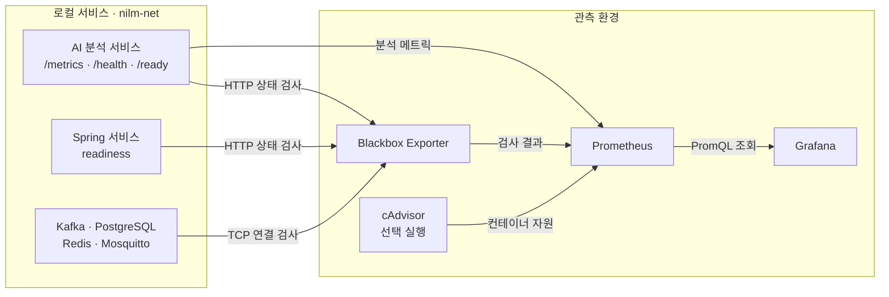

# Prometheus·Grafana 관측 환경 구현 현황

## 1. 구현 목적

- 서비스 코드를 수정하지 않고 현재 확인 가능한 상태 정보 수집
- `ai/realtime-analysis-service`가 제공하는 분석 메트릭 수집 및 시각화
- 로컬 Docker 환경에서 먼저 검증한 뒤 EC2-A/B 환경으로 확장
- Prometheus 설정과 Grafana 대시보드를 파일로 관리하여 실행할 때 자동 적용

## 2. 전체 구성



- Prometheus
  - 15초마다 메트릭 수집
  - 기본 보존 기간 15일
  - 최대 저장 용량 5GB
- Grafana
  - Prometheus를 기본 데이터소스로 자동 등록
  - 대시보드 3개 자동 등록
- Blackbox Exporter
  - 기존 HTTP 주소와 TCP 포트를 외부에서 검사
- cAdvisor
  - Linux 환경에서 필요할 때 선택 실행
  - 컨테이너 CPU·메모리·네트워크 사용량 수집

## 3. 서비스 코드와 관계없이 수집하는 데이터

Blackbox Exporter는 서비스에 별도 메트릭 코드가 없어도 기존 상태 확인 주소와 포트를 검사한다.

### HTTP 상태 검사

| 데이터 | 의미 | 활용 |
| --- | --- | --- |
| `probe_success` | HTTP 요청 성공 여부, 성공 `1`·실패 `0` | 서비스 가용성 확인 |
| `probe_duration_seconds` | 요청부터 응답까지 걸린 시간 | 응답 지연 증가 확인 |
| `probe_http_status_code` | 실제 HTTP 상태 코드 | `401`, `403`, `503` 등 실패 원인 구분 |

- 로컬 검사 대상
  - AI: `/health`, `/ready`
  - API Gateway: `/actuator/health/readiness`
  - IoT Device Service: `/actuator/health/readiness`
  - Monitoring Service: `/actuator/health/readiness`
  - Keycloak: `/health/ready`
- 해석 방법
  - `/health`: 프로세스가 살아 있는지 확인
  - `/ready`: DB·Kafka 등 의존 서비스까지 준비됐는지 확인
  - `probe_success=0`과 상태 코드를 함께 확인하여 장애 범위 구분

### TCP 연결 검사

| 데이터 | 의미 | 활용 |
| --- | --- | --- |
| `probe_success` | 지정 포트 연결 성공 여부 | 기반 서비스 접근 가능 여부 확인 |
| `probe_duration_seconds` | TCP 연결에 걸린 시간 | 네트워크 또는 서비스 지연 징후 확인 |

- 로컬 검사 대상
  - Kafka `19092`
  - PostgreSQL `5432`
  - Redis `6379`
  - Mosquitto `1883`
- TCP 성공은 포트가 열려 있다는 의미
- DB 쿼리 성공, Kafka 메시지 처리, MQTT 인증 성공까지 보장하지는 않음

### 관측 구성 자체의 상태

| 데이터 | 의미 |
| --- | --- |
| `up{job="prometheus"}` | Prometheus 자기 수집 상태 |
| `up{job="grafana"}` | Grafana 메트릭 주소 수집 상태 |
| `up{job="blackbox-exporter"}` | Blackbox Exporter 수집 상태 |
| `up{job="ai-analysis"}` | AI `/metrics` 수집 상태 |

- `up=1`: Prometheus가 대상의 메트릭 주소를 정상 수집
- `up=0`: 주소 해석, 네트워크, 포트, 응답 형식 등의 문제 발생
- Blackbox 검사에서는 `up`과 `probe_success`를 구분
  - `up`: Prometheus에서 Blackbox Exporter 호출 성공
  - `probe_success`: Blackbox Exporter에서 실제 대상 서비스 검사 성공

### 컨테이너 자원 정보

cAdvisor 선택 구성을 실행했을 때 다음 데이터를 표시한다.

| 데이터 | 활용 가능한 분석 |
| --- | --- |
| CPU 사용량 | 처리량 증가 시 CPU 병목 여부 확인 |
| 메모리 Working Set | 지속적인 메모리 증가 및 과다 사용 확인 |
| 네트워크 수신·송신량 | 메시지 증가와 네트워크 사용량 관계 확인 |
| 마지막 메트릭 갱신 시각 | 컨테이너 중단 또는 수집 단절 확인 |

- 로컬 Docker Desktop에서는 Linux 가상 머신 내부 기준으로 보일 수 있음
- 기본 실행에는 포함하지 않으며 `compose.resources.yaml`을 추가할 때 활성화

## 4. AI 분석 서비스가 제공하는 데이터

AI 서비스는 `/metrics`에서 Prometheus 형식으로 다음 메트릭을 제공한다.

| 메트릭 | 종류 | 구분 기준 | 의미 |
| --- | --- | --- | --- |
| `nilm_analysis_stage_duration_seconds` | Histogram | `stage` | 분석 단계별 처리 시간 |
| `nilm_analysis_e2e_duration_seconds` | Histogram | 없음 | 측정 시각부터 Snapshot 생성까지 시간 |
| `nilm_analysis_messages_total` | Counter | `status` | 입력 메시지 처리 결과 누적 건수 |
| `nilm_analysis_dlq_messages_total` | Counter | `reason` | DLQ 발행 누적 건수 |
| `nilm_analysis_errors_total` | Counter | `stage`, `error_type` | 단계·예외 종류별 오류 누적 건수 |
| `nilm_analysis_consumer_lag_messages` | Gauge | `topic`, `partition` | Kafka 파티션별 Consumer Lag |
| `nilm_analysis_model_info` | Info | `name`, `version` | 현재 Manifest의 모델 이름과 버전 |

### 단계별 처리 시간

주요 `stage` 값은 다음과 같다.

| 구간 | 측정 범위 |
| --- | --- |
| `consumer_poll` | Kafka 메시지 조회 대기 |
| `deserialize_validate` | JSON 변환과 입력 검증 |
| `observation_db` | 원본 관측 정보 DB 반영 |
| `buffer_append` | 가구별 분석 버퍼 적재 |
| `preprocess` | 모델 입력 전처리 |
| `inference` | 모델 추론 |
| `state_decision_transition` | 가전 상태 판정과 상태 전이 계산 |
| `activity_db` | 가전 활동 정보 DB 저장 |
| `snapshot_publish_ack` | Snapshot Kafka 발행 확인 |
| `anomaly_detection` | 생활 패턴 이상 탐지 |
| `event_publish_ack` | 이상 이벤트 Kafka 발행 확인 |
| `offset_commit` | Kafka 입력 Offset 반영 |
| `dlq_publish_ack` | 잘못된 입력의 DLQ 발행 확인 |

- 각 단계 시간을 초 단위 Histogram으로 기록
- 평균뿐 아니라 p50·p95·p99처럼 분포 기반 분석 가능
- 단계별 지연을 비교하여 전체 처리 지연의 원인 파악

### 메시지 처리 결과

`nilm_analysis_messages_total`의 주요 상태:

| 상태 | 의미 |
| --- | --- |
| `processed` | 입력 처리를 마치고 Offset까지 반영 |
| `dlq` | 입력 오류로 DLQ에 발행하고 Offset 반영 |
| `failed` | 처리 도중 예외 발생 |

- Counter는 계속 증가하는 누적값
- Grafana에서는 `rate()`로 초당 처리량, `increase()`로 선택 기간 처리 건수 표현
- `processed`에는 분석 버퍼가 아직 차지 않아 추론하지 않은 입력도 포함

### E2E 지연

```text
E2E 지연 = Snapshot 생성 시각 - 센서 측정 시각
```

- 센서 데이터가 분석 결과로 변환되기까지의 체감 지연 확인
- 시간대별 p50·p95·p99를 비교하여 일반 지연과 느린 요청 구분
- 현재 `published_at`은 Kafka 발행 전 Snapshot 생성 시각
- Kafka 발행 ACK 시간은 `snapshot_publish_ack` 단계에서 별도 확인
- 음수 값은 서버와 센서의 시각 차이로 판단하여 `ClockSkew` 오류로 기록

### Consumer Lag

```text
Consumer Lag = Kafka high watermark - 현재 consumer position
```

- 파티션별 적체량 표시
- 토픽 전체 합계 표시
- 처리량과 함께 비교하여 입력 증가인지 처리 성능 저하인지 판단
- 캐시된 high watermark와 현재 position 기준이며 committed offset 기준과는 다름

### DLQ와 오류

- DLQ
  - JSON 변환 실패
  - 입력 검증 실패
  - 사유별 발생 속도 표시
- 오류
  - 처리 파이프라인 예외
  - Consumer Lag 갱신 예외
  - 시각 차이 오류
  - 단계와 예외 종류별 발생 속도 표시
- 최초 오류가 발생하기 전에는 시계열이 없어 `No data`로 보일 수 있음

## 5. Grafana 표현 방식

Grafana에는 `NILM Observability` 폴더와 다음 대시보드가 자동 등록된다.

### NILM · 서비스 가용성

| 패널 | 표시 내용 |
| --- | --- |
| 수집 대상 상태 | Prometheus가 각 메트릭 주소를 수집하는지 표시 |
| HTTP 준비 상태 | 서비스별 성공·실패 표시 |
| HTTP 응답 시간 | 서비스별 응답시간 변화 그래프 |
| HTTP 응답 코드 | 서비스별 최근 상태 코드 표시 |
| TCP 연결 상태 | Kafka·DB·Redis·Mosquitto 연결 가능 여부 |
| 성공 비율 | 선택 기간의 HTTP·TCP 성공 비율 |

### NILM · AI 분석

| 패널 | 표현 방식 | 확인 목적 |
| --- | --- | --- |
| AI 수집 상태 | `UP`·`DOWN` 상태값 | 메트릭 수집 단절 확인 |
| Manifest 모델 | 이름·버전 | 배포 모델 확인 |
| 입력 처리량 | 상태별 초당 건수 그래프 | 처리량 변화 확인 |
| 기간 처리 건수 | 상태별 누적 증가량 | 기간별 처리 결과 비교 |
| 단계별 지연 | 평균·p95 그래프 | 병목 단계 탐색 |
| E2E 지연 | p50·p95·p99 그래프 | 사용자 체감 지연과 이상치 확인 |
| Consumer Lag | 파티션별·토픽 합계 그래프 | Kafka 적체 확인 |
| DLQ·오류 | 사유·예외별 초당 발생량 | 입력 품질 및 장애 확인 |
| Python 자원 | RSS 메모리·CPU | AI 프로세스 자원 증가 확인 |

### NILM · 컨테이너 자원

- cAdvisor를 활성화했을 때 데이터 표시
- Compose 프로젝트와 서비스 단위로 CPU·메모리·네트워크 사용량 비교
- 현재 로컬에서 활성화하지 않았다면 `No data`가 정상

## 6. 가능한 분석

| 확인하려는 문제 | 함께 볼 데이터 | 판단 예시 |
| --- | --- | --- |
| AI 결과가 늦게 도착함 | E2E p95, 단계별 p95 | `inference` 증가면 모델 연산, `activity_db` 증가면 DB 확인 |
| Kafka 적체가 늘어남 | Consumer Lag, 처리량, CPU | 처리량 정체와 CPU 상승이면 처리 용량 부족 가능성 |
| 입력 품질이 나빠짐 | DLQ 발생률, `reason` | JSON 오류와 검증 오류 비율 비교 |
| 서비스 접속 장애 | `probe_success`, 상태 코드, 응답시간 | `503`이면 의존성 미준비, 응답 없음이면 네트워크·프로세스 확인 |
| 배포 후 성능 변화 | 모델 버전, 단계별 지연, 처리량 | 모델 변경 시점 전후의 추론 시간 비교 |
| 메모리 누수 의심 | Python RSS 또는 cAdvisor 메모리 | 트래픽 감소 후에도 메모리가 계속 증가하는지 확인 |

## 7. 로컬 환경 설계

- 애플리케이션과 관측 환경을 별도 Compose 프로젝트로 실행
- 두 프로젝트가 기존 외부 네트워크 `nilm-net`을 공유
- Prometheus가 컨테이너 IP 대신 Docker 서비스 이름으로 접근
  - `realtime-analysis-service:8000`
  - `monitoring-service:8082`
  - `kafka:19092`
- 컨테이너가 재생성되어 IP가 바뀌어도 대상 설정 유지
- 환경별 대상 목록 분리
  - `prometheus/targets/local`
  - `prometheus/targets/ec2-a`
  - `prometheus/targets/ec2-b`
- 대상 JSON 변경은 최대 30초 뒤 자동 반영
- Grafana 대시보드 JSON 변경도 최대 30초 뒤 자동 반영
- 호스트 포트
  - Grafana `13001`: 기존 Frontend·Grafana 기본 포트와 충돌 방지
  - Prometheus `19090`: Prometheus 기본 포트 및 기존 프로그램과 충돌 방지
- Grafana는 Docker 내부의 `prometheus:9090`을 사용하므로 호스트 포트를 바꿔도 영향 없음

### 로컬 실행값

```dotenv
APPLICATION_NETWORK=nilm-net
TARGET_ENV=local
EC2_B_PRIVATE_IP=127.0.0.1
PROMETHEUS_PORT=19090
GRAFANA_PORT=13001
```

```powershell
cd infrastructure/observability
docker compose --env-file .env up -d prometheus blackbox-exporter grafana
```

- Prometheus: `http://localhost:19090`
- Targets: `http://localhost:19090/classic/targets`
- Grafana: `http://localhost:13001`

## 8. 확장 가능성

### 서비스별 메트릭 추가

- Spring 서비스
  - Micrometer Prometheus 의존성 추가
  - `/actuator/prometheus` 공개
  - JVM, HTTP 요청, DB 연결 풀 지표 수집
- PostgreSQL
  - PostgreSQL Exporter 추가
  - 연결 수, 느린 쿼리, 트랜잭션, 저장 공간 분석
- Kafka
  - Kafka Exporter 또는 JMX Exporter 추가
  - Consumer Group committed lag, 처리량, 브로커 상태 분석
- Redis·Mosquitto
  - 전용 Exporter 추가
  - 명령 처리량, 연결 수, 메시지 처리량 분석

### EC2-A/B 분리 배포

- EC2-A
  - Prometheus·Grafana·Blackbox Exporter 실행
  - EC2-A 내부 서비스는 Docker 네트워크로 수집
- EC2-B
  - AI `/metrics`를 사설 IP에서 접근할 수 있도록 연결
  - 보안 그룹은 EC2-A에서 오는 TCP 8000만 허용
- 연결 준비 전에는 로컬 환경에서 대시보드와 PromQL 검증 가능
- EC2-B 자원까지 보려면 EC2-B에 cAdvisor 또는 Node Exporter를 별도 실행

### 운영 기능 추가

- Alertmanager 연동
  - 서비스 중단
  - Consumer Lag 임계치 초과
  - E2E 지연 증가
  - 오류·DLQ 급증 알림
- 장기 보관이 필요하면 외부 시계열 저장소 연동
- 환경·인스턴스 라벨을 이용해 local, 개발, 운영 대시보드 분리
- 서비스가 늘어나면 대상 파일만 추가하여 기존 구성 유지

## 9. 현재 제한 사항

- AI 외 서비스는 내부 업무 메트릭을 제공하지 않음
- Blackbox 데이터만으로 서비스 내부 병목 원인을 직접 알 수 없음
- TCP 검사는 연결 가능 여부만 확인
- AI E2E 지연은 Kafka 발행 ACK 이후까지 포함하지 않음
- AI Consumer Lag은 committed offset 기준이 아님
- 알림 규칙과 외부 알림 전송은 아직 구성하지 않음
- cAdvisor는 기본 실행에서 비활성화

## 10. 빠른 확인 쿼리

```promql
# AI 메트릭 수집 상태
up{job="ai-analysis"}

# HTTP 대상의 실제 상태
probe_success{job="service-http"}

# TCP 대상의 실제 상태
probe_success{job="service-tcp"}

# AI 입력 처리 누적 건수
nilm_analysis_messages_total

# Kafka 파티션별 적체량
nilm_analysis_consumer_lag_messages
```

- `up{job="ai-analysis"}=1`: AI 메트릭 수집 정상
- 빈 결과: 아직 해당 시계열이 생성되지 않았거나 대상 설정이 적용되지 않음
- 처리량·분위수 그래프는 최소 두 번 이상 수집된 뒤 표시
